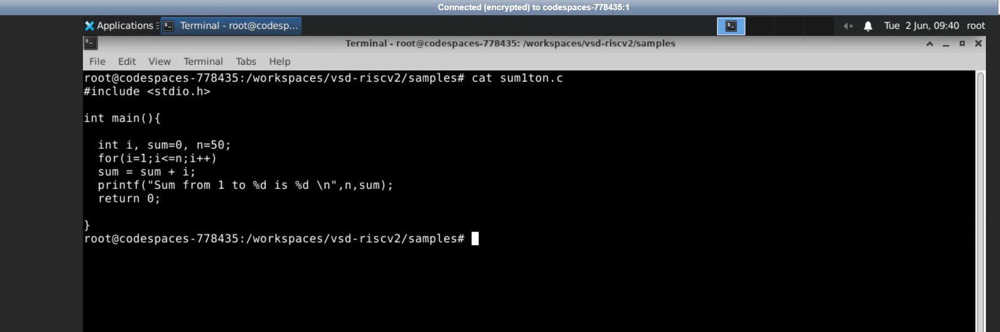
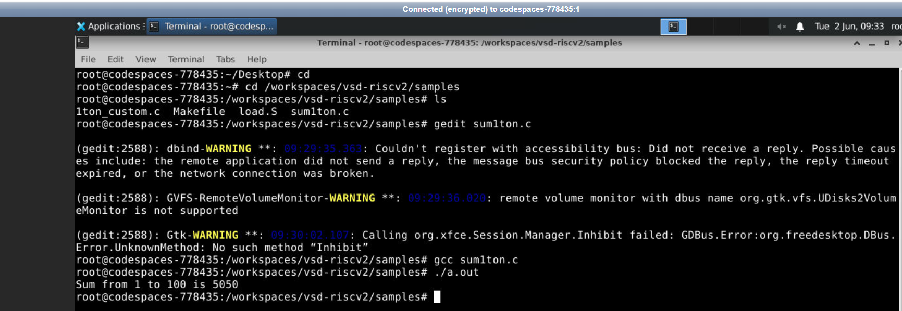
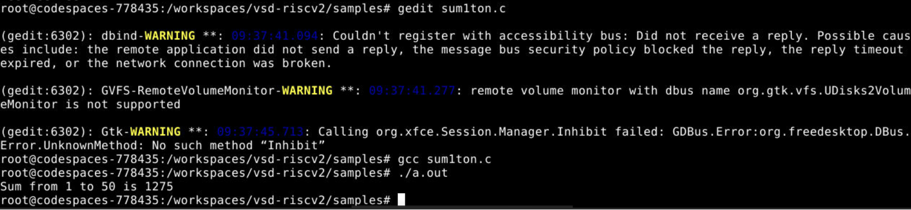
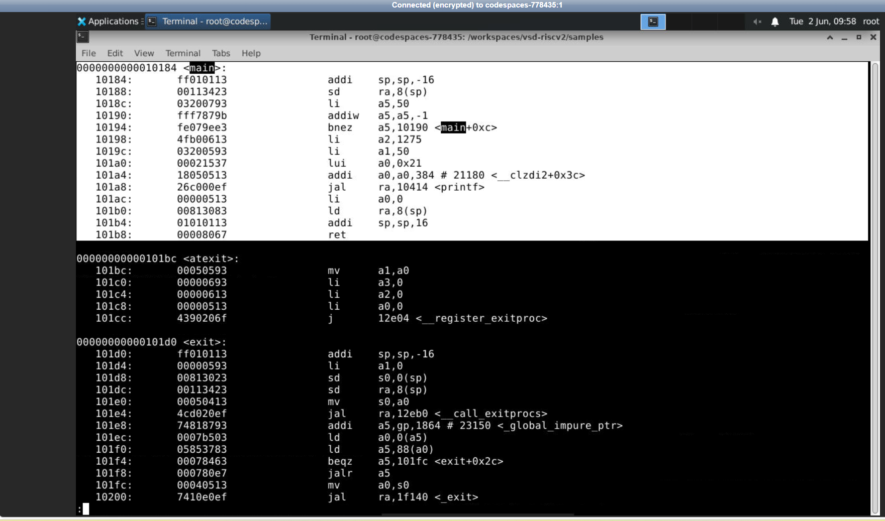
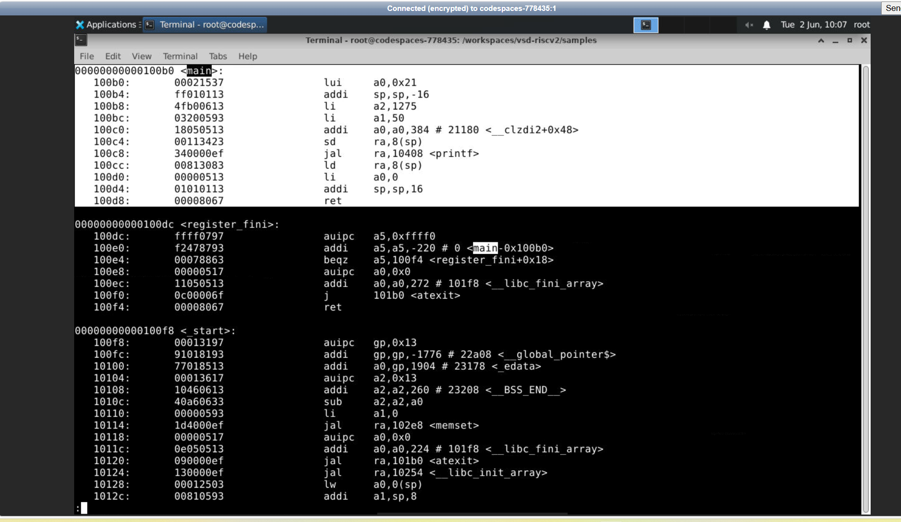

# RISC-V Lab – Sum 1 to N (C + RISC-V Toolchain)

> **Task 1** – To compile a simple C program of sum1ton using both native GCC and RISC-V GCC compilers.

---

## 📋 Table of Contents

1. [Task Overview](#task-overview)
2. [Tools & Environment](#tools--environment)
3. [C Source Code](#c-source-code)
4. [Compiling with GCC (x86)](#compiling-with-gcc-x86)
5. [Compiling with RISC-V Toolchain](#compiling-with-risc-v-toolchain)
6. [Object Dump – `-O1` Optimization](#object-dump----o1-optimization)
7. [Object Dump – `-Ofast` Optimization](#object-dump----ofast-optimization)
8. [Comparison: `-O1` vs `-Ofast`](#comparison--o1-vs--ofast)
9. [Screenshots](#screenshots)
10. [Learnings](#learnings)
11. [Conclusion](#conclusion)

---

## Task Overview

The objective of this task is to:
- Write a small C program that computes the sum from 1 to N
- Compile and execute this code using a standard GCC compiler
- Cross compile this code using the RISC-V compiler GCC toolchain (`riscv64-unknown-elf-gcc`) with both optimization levels `-O1` and `-Ofast`
- Examine the generated RISC-V assembly using `objdump`
- Comprehend how the compiler optimizations influence the instruction count

---

## Tools & Environment

| Tool | Purpose |
|------|---------|
| `gedit` | GUI text editor used to edit the C file |
| `gcc` | Standard GNU C Compiler for x86 (host machine testing) |
| `riscv64-unknown-elf-gcc` | RISC-V cross-compiler for generating RISC-V object files |
| `riscv64-unknown-elf-objdump` | Disassembler to view RISC-V assembly from object files |
| `less` | Pager utility to scroll through long objdump output |

**Working Directory:** `/workspaces/vsd-riscv2/samples`

---

## C Source Code

`sum1ton.c` computes the sum of all integers from 1 to `n` and compiled using bothe gcc and riscv based approach..

```c
#include <stdio.h>

int main(){
    int i, sum=0, n=50;
    for(i=1;i<=n;i++)
        sum = sum + i;
    printf("Sum from 1 to %d is %d \n", n, sum);
    return 0;
}
```

## Screenshots

### Source Code in gedit (n=100)


### Source Code displayed using `cat` command (n=50)



---

## Compiling with GCC (x86)

### Commands Used

```bash
# Navigate to working directory
cd /workspaces/vsd-riscv2/samples

# Open file in gedit editor (GUI)
gedit sum1ton.c

# Compile with standard GCC
gcc sum1ton.c

# Run the output
./a.out
```

### Explanation

| Command | Description |
|---------|-------------|
|`cd /workspaces/vsd-riscv2/samples` | Change to the directory containing the sample files |
|`gedit sum1ton.c` | Edit the file using the graphical interface text editor |
|`gcc sum1ton.c` | Compile the program written in C using the host GCC compiler (output will be `a.out` by default) |
|`./a.out` | Run the compiled program |

### Output

- With `n=100`: `Sum from 1 to 100 is 5050`
- With `n=50`: `Sum from 1 to 50 is 1275`

> 
>   
---

## Compiling with RISC-V Toolchain

### Command for `-O1`

```bash
riscv64-unknown-elf-gcc -O1 -mabi=lp64 -march=rv64i -o sum1ton.o sum1ton.c
```

### Command for `-Ofast`

```bash
riscv64-unknown-elf-gcc -Ofast -mabi=lp64 -march=rv64i -o sum1ton.o sum1ton.c
```

### Flag Explanations

| Flag | Meaning |
|------|---------|
| `riscv64-unknown-elf-gcc` | Cross compiler for RISC-V 64-bit to create an ELFTM binary without an operating system |
| `-O1` | Basic optimizations – code shrinkage and increase in speed |
| `-Ofast` | Fast optimizations – enables all optimizations `-O3` plus other optimizations like loop unrolling and constant folding |
| `-mabi=lp64` | Specifying the ABI: **L**ong and **P**ointers will be **64**-bits |
| `-march=rv64i` | Specifies the target architecture: **R**ISC-V 64-bit with **I**nteger instruction set only |
| `-o sum1ton.o` | Output file to be named `sum1ton.o` |
| `sum1ton.c` | Input file |

---

## Object Dump – `-O1` Optimization

### Command

```bash
riscv64-unknown-elf-objdump -d sum1ton.o | less
```

### Explanation

| Part           | Description                               |
| -------------- | ----------------------------------------- |
| `riscv64-unknown-elf-objdump` | RISC-V disassembler tool      |
| `-d`          | Disassemble the object file to assembly   |
| `sum1ton.o`   | RISC-V ELF object file                   |
| `\| less`     | Send the output to `less` for interactive viewing |

###  Instruction Count Calculation (`-O1`)

From the objdump screenshot, the `<main>` function occupies the following address range:

```
<main>  starts at : 0x10184
<atexit> starts at : 0x101bc   ← this is where the next function begins
```

Since in RISC-V each instruction is exactly **4 bytes** wide:

```
Number of bytes  = 0x101bc − 0x10184
               = 0x38
               = 56 (decimal)

Number of instructions = 56 ÷ 4 = 14 instructions
```

> **`main` compiled with `-O1` uses exactly 14 instructions.**

### Instruction-by-Instruction Walkthrough (`-O1`)

| Address | Hex Encoding | Instruction | Explanation |
|---------|-------------|-------------|-------------|
| `10184` | `ff010113` | `addi sp,sp,-16` | Prologue: allocate 16 bytes on the stack for the stack frame |
| `10188` | `00113423` | `sd ra,8(sp)` | Save return address register `ra` onto the stack |
| `1018c` | `03200793` | `li a5,50` | Load immediate: set loop counter `a5 = 50` (value of `n`) |
| `10190` | `fff7879b` | `addiw a5,a5,-1` | Decrement loop counter: `a5 = a5 - 1`|
| `10194` | `fe079ee3` | `bnez a5,10190` | Branch if `a5 ≠ 0` → jump back to `10190` |
| `10198` | `4fb00613` | `li a2,1275` | Load the **pre-computed sum** `1275` into `a2` (3rd printf arg) |
| `1019c` | `03200593` | `li a1,50` | Load `n=50` into `a1` (2nd printf arg: `%d` = n) |
| `101a0` | `00021537` | `lui a0,0x21` | Load upper 20 bits of printf format string address into `a0` |
| `101a4` | `18050513` | `addi a0,a0,384` | Add lower 12 bits → complete the format string address in `a0` |
| `101a8` | `26c000ef` | `jal ra,10414 <printf>` | Call `printf` — jump and link |
| `101ac` | `00000513` | `li a0,0` | Load return value `0` into `a0` (for `return 0`) |
| `101b0` | `00813083` | `ld ra,8(sp)` | Restore return address from stack |
| `101b4` | `01010113` | `addi sp,sp,16` | deallocate the 16-byte stack frame |
| `101b8` | `00008067` | `ret` | Return|

### Key Insights (`-O1`)

- Loop body is there but this is a countdown loop; compiler replaced `for(i=1;i<=50;i++)` with a decremented version where `a5` counts 50 to 0
- Some constant folding occurs: the loop executes but the value `1275` is calculated and stored via `li a2,1275` in the register — this makes the loop a null operation that just counts down
- `sd ra,8(sp)` and `ld ra,8(sp)` indicate a stack frame is constructed and destroyed properly (correct function calling conventions)
- `jal` is Jump And Link instruction; returns the current address in `ra` and jumps to `printf`
> `objdump_sum_o1.png` – Full objdump output with `-O1`



---

## Object Dump – `-Ofast` Optimization

### Command

```bash
riscv64-unknown-elf-objdump -d sum1ton.o | less
```
###  Instruction Count Calculation (`-Ofast`)

From the objdump , the `<main>` function occupies:

```
<main>           starts at : 0x100b0
<register_fini>  starts at : 0x100dc   ← this is where the next function begins
```

Since in RISC-V each instruction is exactly **4 bytes** wide:

```
Number of bytes  = 0x100dc − 0x100b0
               = 0x2c
               = 44 (decimal)

Number of instructions = 44 ÷ 4 = 11 instructions
```

> **`main` compiled with `-Ofast` uses exactly 11 instructions — 3 fewer than `-O1`.**

### Instruction-by-Instruction Walkthrough (`-Ofast`)

| Address | Hex Encoding | Instruction | Explanation |
|---------|-------------|-------------|-------------|
| `100b0` | `00021537` | `lui a0,0x21` | Load upper 20 bits of format string address into `a0` |
| `100b4` | `ff010113` | `addi sp,sp,-16` | Prologue: allocate 16-byte stack frame |
| `100b8` | `4fb00613` | `li a2,1275` | Directly load **compile-time constant** `1275` into `a2` — loop eliminated entirely! |
| `100bc` | `03200593` | `li a1,50` | Load `n=50` into `a1` (2nd printf argument) |
| `100c0` | `18050513` | `addi a0,a0,384` | Complete the format string address in `a0` (lower 12 bits) |
| `100c4` | `00113423` | `sd ra,8(sp)` | Save return address register `ra` onto the stack |
| `100c8` | `340000ef` | `jal ra,10408 <printf>` | Call `printf` |
| `100cc` | `00813083` | `ld ra,8(sp)` | Restore return address from stack |
| `100d0` | `00000513` | `li a0,0` | Load return value `0` into `a0` |
| `100d4` | `01010113` | `addi sp,sp,16` | Epilogue: deallocate the 16-byte stack frame |
| `100d8` | `00008067` | `ret` | Return to caller |

### Key Insights (`-Ofast`)

- **The whole loop is missing** - There’s no `addiw`, no `bnez`, no loop counter register. The compiler was able to calculate this at compile time.
- The data-loading instruction (`li a2,1275`) is the **first such instruction** that comes in the program - The sum `1+2+...+50=1275` was folded by `-Ofast`.
- The sequence of `lui a0,0x21` followed by `addi a0,a0,384` creates an address for the printf format string. This pattern of a **2-instruction PC relative address load** is typical for RISC-V.
- `sd ra,8(sp)` instruction to save `ra` register was moved to **follow** the `li` instructions. It is **instruction scheduling**, done by the compiler to prevent stalling pipelines.
- The `printf` call points to `10408` in this listing, compared to `10414` with `-O1`. It happens because the binary got a new layout.



---

## Comparison: `-O1` vs `-Ofast`

| Aspect | `-O1` | `-Ofast` |
|--------|-------|---------|
| **`main` start address** | `0x10184` | `0x100b0` |
| **Next function address** | `0x101bc` (`<atexit>`) | `0x100dc` (`<register_fini>`) |
| **Bytes in `main`** | `0x101bc − 0x10184 = 0x38 = 56 bytes` | `0x100dc − 0x100b0 = 0x2c = 44 bytes` |
| **Instruction count** | **56 ÷ 4 = 14 instructions** | **44 ÷ 4 = 11 instructions** |
| **Loop present?** |  Yes (`addiw` + `bnez` countdown loop) | No |
| **Sum computed at** | Runtime (loop runs, but sum preloaded separately) | Compile time  |
| **`li a2` value** | `1275` (precomputed with the loop) | `1275` (only instruction for sum) |
| **Instruction scheduling** | Sequential, standard order | Reordered (`sd ra` moved after `li` instructions) |
| **Stack frame** | Standard | Same, but instructions reordered |
| **`printf` call target** | `10414` | `10408` |
| **Binary size (main only)** | 56 bytes | 44 bytes |

### Address Calculation Summary

```
-O1 :  0x101bc - 0x10184 = 0x38 = 56 bytes → 56 / 4 = 14 instructions
-Ofast: 0x100dc - 0x100b0 = 0x2c = 44 bytes → 44 / 4 = 11 instructions

Reduction: 14 - 11 = 3 fewer instructions with -Ofast (≈ 21% reduction)
```

### Key Insight

Even for `-O1`, GCC does **constant folding** in the sense that it realizes that `1+2+…+50=1275` can be done at compile time. Not for `-O1`, GCC outputs the loop code itself as dead code. However, `-Ofast` optimization level is significant enough to remove the loop altogether, leaving us with a compact 11-instruction `main` function.

---

## Screenshots

| Image | Description |
|-------|-------------|
| `sum-1ton_c-code.png` | C source code (`n=100`) open in `gedit` editor |
| `sum-1ton_cat.png` | C source code (`n=50`) in terminal using cat `cat sum1ton.c` |
| `result-1_sum.png` | GCC compile + run with `n=100`, output: `Sum from 1 to 100 is 5050` |
| `result-2_sum.png` | GCC compile + run with `n=50`, output: `Sum from 1 to 50 is 1275` |
| `objdump_sum_o1.png` | RISC-V objdump of binary compiled with `-O1` — 14 instructions in `main` |
| `objdump_sum_ofast.png` | RISC-V objdump of binary compiled with `-Ofast` — 11 instructions in `main` |

---

## Learnings

### 1. Cross-Compilation Idea
The **cross-compilation**, as done with `riscv64-unknown-elf-gcc`, is a process of running a compiler in one environment (x86-based host) and producing object code suitable for a completely different target architecture (RISC-V 64).It is necessary for embedded systems and VLSI development when the hardware does not possess sufficient capabilities to operate a compiler.

### 2. Instruction Width in RISC-V
All instructions in the basic `rv64i` RISC-V ISA have a fixed size of **4 bytes (32 bits)**. The number of instructions can be computed very simply:
```
instruction_count = (end_address − start_address) / 4
```
This characteristic provides clear advantages compared to the x86 ISA, whose instructions vary in width within 1–15 bytes.

### 3. How to Parse `objdump` Output
- **The first column** represents the memory address of the instruction (in hex format).
- **The second column** contains the hex representation of the machine code.
- **The third column** shows the mnemonic of the assembly code.
- **The fourth column** is the operand(s).
- **The next function label** encountered in the dump indicates that we’ve reached the end of the function; thus, we can determine its size by subtracting the start label from it.

### 4. Compiler Optimizations – Constant Folding
Both the `-O1` and `-Ofast` optimizations did **constant folding** in this program. As `n=50` is known at compile time, the compiler computes the value `sum = 1+2+…+50 = 1275` during compilation and outputs the value `li a2,1275` without doing any computations at runtime.

### 5. `-O1` vs `-Ofast` — What's Different
| Optimization | `-O1` | `-Ofast` |
|---|---|---|
| Constant folding |  Yes |  Yes |
| Dead code / loop elimination |  No (loop present) |  Yes (loop removed) |
| Instruction scheduling | Minimal |  Yes (reorders for pipeline) |

### 6. ABI and Architecture Are Important
- `-mabi=lp64` informs the compiler on how to pass arguments and register width (Long=64-bit, Pointer=64-bit)
- `-march=rv64i` limits the compiler to using only base integer instruction set; there will be no hardware floating point nor any extensions for multiplication 
- Changing any of these flags would produce a completely different assembly language

### 7. RISC-V Calling Conventions
By looking at objdump output, we can see the calling conventions specified in the **RISC-V ABI**:
- `a0` - 1st argument of a function / return value
- `a1` - 2nd argument
- `a2` - 3rd argument
- `ra` - return address (you need to save/restore this register when you call another function)
- `sp` - stack pointer (16-byte )
---

## Conclusion
In this experiment, the entire process of writing, compiling, and analyzing a C program for the **RISC-V 64-bit processor** was successfully performed.

**What was accomplished:**

1. A basic C program (`sum1ton.c`) was developed to calculate the sum of numbers from 1 to N and then tested on the host machine by executing `gcc`, generating outputs such as `5050` (when N=100) and `1275` (when N=50)

2. Then, the same C program was compiled using `riscv64-unknown-elf-gcc` compiler with both levels of optimization, and the generated ELF files disassembled using `objdump`

3. **Instruction counting based on addresses** was done, and the following results were found:
   - `-O1` -> `0x101bc − 0x10184 = 56 bytes -> **14 instructions**`
   - `-Ofast` -> `0x100dc − 0x100b0 = 44 bytes -> **11 instructions**`

4. As seen from these observations, we can note that **optimizations implemented by compilers are quite effective and can be measured** – `-Ofast` decreases number of instructions by 21% (3 instructions) relative to `-O1` for this particular task

5. The key lesson that should be learned is how to read and understand the results of compilation **into assembly output** since this is a fundamental part of developing for VLSI / RISC-V architecture
---
