# RISC-V Lab – Task 2: SPIKE Simulation & Factorial Program Example

> **Task 2** – SPIKE Simulation · Observation with `-O1` and `-Ofast` · Factorial C Program Example · Debugger Walkthrough
---

## Table of Contents

1. [Task Overview](#task-overview)
2. [Tools & Environment](#tools--environment)
3. [Part A – Sum 1 to N (With SPIKE)](#part-a--sum-1-to-n-with-spike)
   - [Source Code](#part-a-source-code)
   - [GCC Compilation & Result](#part-a-gcc-complation--result)
   - [RISC-V Compilation & Commands](#part-a-risc-v-compilation-commands)
   - [SPIKE Simulation – Run](#part-a-spike-simulation--run)
   - [Objdump `-O1`](#part-a-objdump--o1)
   - [Objdump `-Ofast`](#part-a-objdump--ofast)
   - [SPIKE Debugger ](#part-a-spike-debugger)
4. [Part B – Factorial Program (Custom Application)](#part-b--factorial-program-custom-application)
   - [Source Code](#part-b-source-code)
   - [GCC Compilation & Result](#part-b-gcc-complation--result)
   - [RISC-V Compilation Commands](#part-b-risc-v-compilation-commands)
   - [SPIKE Simulation – Run](#part-b-spike-simulation--run)
   - [Objdump `-O1`](#part-b-objdump--o1)
   - [Objdump `-Ofast`](#part-b-objdump--ofast)
   - [SPIKE Debugger ](#part-b-spike-debugger)
5. [Comparison Table](#Comparison-table)
6. [Screenshots Index](#screenshots-index)
7. [Learnings](#learnings)
8. [Conclusion](#conclusion)

---

## Task Overview

This task is the extended version of Task 1 with two major additions:

1. **SPIKE simulation** — run RISC-V ELF binaries on the Spike ISA simulator using the proxy kernel (`pk`), confirming that cross-compiled binaries produce the same correct output as native GCC
2. **Custom C application Example(Factorial)** — write `nfact.c` to compute factorial of N using gcc and spike, cross-compile with `-O1` and `-Ofast`, inspect assembly via `objdump`, and debug step-by-step using Spike's interactive debugger (`spike -d`)

Both `sum1ton.c` and `nfact.c` go through the complete workflow:

```
Write C → gcc (host compiler) → riscv-gcc (-O1 / -Ofast) → objdump → spike pk → spike -d
```

---

## Tools & Environment

| Tool | Purpose |
|------|---------|
| `gedit` | GUI text editor to edit C source files and texts |
| `gcc` | Host GCC compiler (x86) for initial verificaton |
| `riscv64-unknown-elf-gcc` | RISC-V 64-bit cross-compiler |
| `riscv64-unknown-elf-objdump` | RISC-V disassembler to inspect generated assembly |
| `spike pk` | Spike RISC-V ISA simulator + proxy kernel — runs RISC-V ELF binaries |
| `spike -d pk` | Spike in **debug mode** — single-step, inspect registers/memory |
| `less` | Pager for minimizing long `objdump` output |

**Working Directory:** `/workspaces/vsd-riscv2/samples`

---

## Part A – Sum 1 to N (With SPIKE)

### Part A: Source Code

```c
#include <stdio.h>

int main(){
    int i, sum=0, n=100;
    for(i=1;i<=n;i++)
        sum = sum + i;
    printf("Sum from 1 to %d is %d \n", n, sum);
    return 0;
}
```

> `sum-1ton_c-code.png` – Source code 

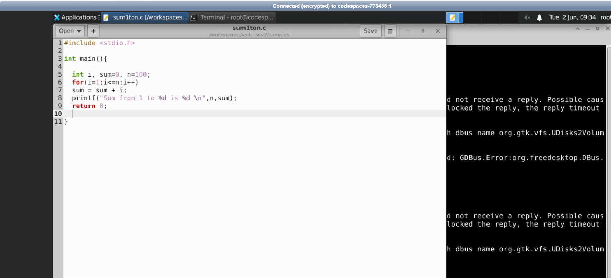

---

### Part A: GCC Compilation & Result

```bash
gcc sum1ton.c
./a.out
```

**Output:** `Sum from 1 to 100 is 5050`

> `result-1_sum.png` – GCC compile and run output, output is sum from 1 to 100 is 5050


---

### Part A: RISC-V Compilation Commands

```bash
# Compile with -O1
riscv64-unknown-elf-gcc -O1 -mabi=lp64 -march=rv64i -o sum1ton.o sum1ton.c

# Compile with -Ofast
riscv64-unknown-elf-gcc -Ofast -mabi=lp64 -march=rv64i -o sum1ton.o sum1ton.c
```

> `objdump_sum_o1_cmd.png` – Terminal showing RISC-V compile + objdump command for `-O1`

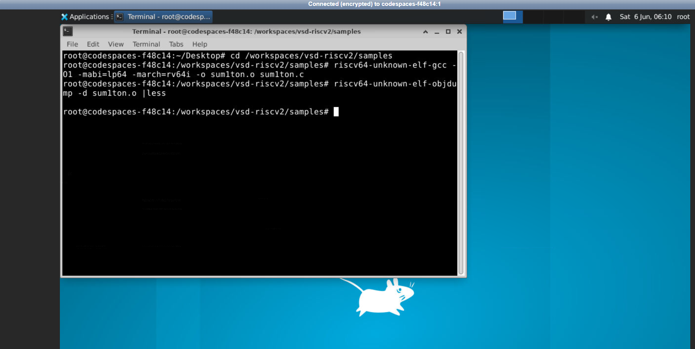

> `objdump_sum_ofast_cmd.png` – Terminal showing RISC-V compile + objdump command for `-Ofast`

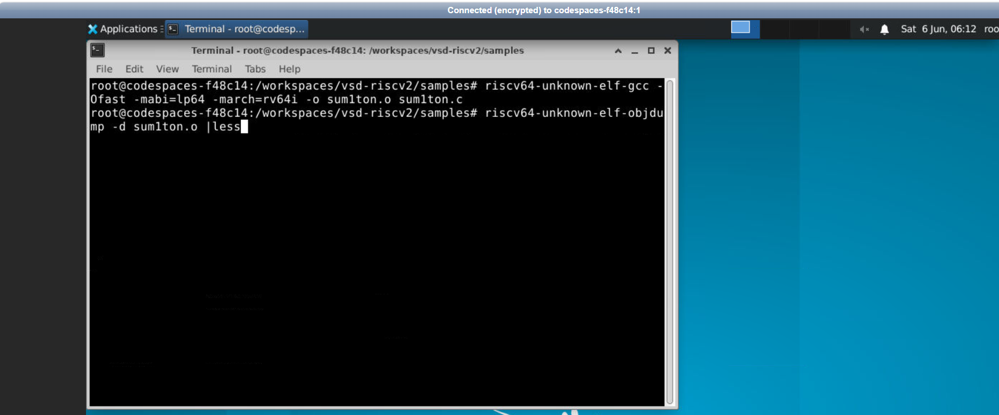

---

### Part A: SPIKE Simulation – Run

```bash
# Run the RISC-V binary using Spike + proxy kernel
spike pk sum1ton.o
```

| Command Part | Explanation |
|---|---|
| `spike` | The Spike RISC-V ISA simulator — simulates a complete RV64I core in software |
| `pk` | Proxy Kernel — a minimal OS shim that handles syscalls (like `printf`) so  ELF binaries can run |
| `sum1ton.o` | The RISC-V ELF binary to simulate |

**Output:** `bbl loader` then `Sum from 1 to 100 is 5050` (matches GCC output exactly)

> `riscv_result-n100_spike.png` – Spike simulation output: Sum from 1 to 100 is 5050

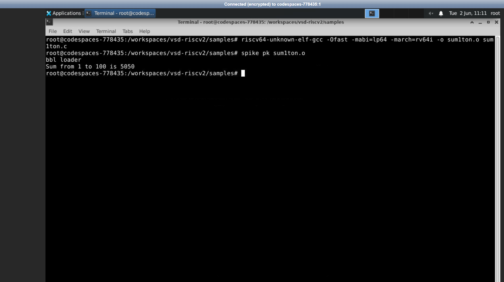

> `riscv_result-n50_spike.png` – Spike simulation output: Sum from 1 to 50 is 1275

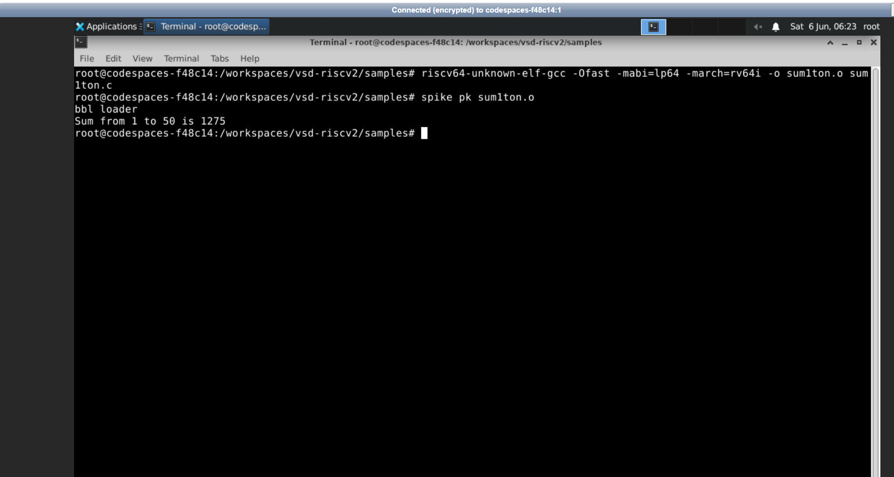

---

### Part A: Objdump `-O1`

```bash
riscv64-unknown-elf-objdump -d sum1ton.o | less
```

#### Instruction Count Calculation (`sum1ton` `-O1`)

From the objdump screenshot:

```
<main>   starts at : 0x10184
<atexit> starts at : 0x101c0   ← first instruction of next function

Bytes  = 0x101c0 − 0x10184 = 0x3c = 60 decimal
Count  = 60 ÷ 4 = 15 instructions
```

> **`sum1ton` with `-O1` uses 15 instructions in `main`**

#### Instruction-by-Instruction Walkthrough

| Address | Hex | Instruction | Explanation |
|---------|-----|-------------|-------------|
| `10184` | `ff010113` | `addi sp,sp,-16` | Allocate 16-byte stack frame |
| `10188` | `00113423` | `sd ra,8(sp)` | Save return address onto stack |
| `1018c` | `06400793` | `li a5,100` | Load loop counter: `a5 = 100` (value of `n`) |
| `10190` | `fff7879b` | `addiw a5,a5,-1` | Decrement loop counter by 1 (32-bit) |
| `10194` | `fe079ee3` | `bnez a5,10190` | Loop back if `a5 ≠ 0` — this is the counting loop |
| `10198` | `00001637` | `lui a2,0x1` | Load upper bits of sum into `a2` |
| `1019c` | `3ba60613` | `addi a2,a2,954` | Complete sum: `0x1000 + 954 = 0x13ba = 5050` loaded into `a2` |
| `101a0` | `06400593` | `li a1,100` | Load `n=100` into `a1` (printf 2nd arg) |
| `101a4` | `00021537` | `lui a0,0x21` | Load upper bits of format string address |
| `101a8` | `19050513` | `addi a0,a0,400` | Complete format string address in `a0` |
| `101ac` | `26c000ef` | `jal ra,10418 <printf>` | Call printf |
| `101b0` | `00000513` | `li a0,0` | Load return value 0 |
| `101b4` | `00813083` | `ld ra,8(sp)` | Restore return address from stack |
| `101b8` | `01010113` | `addi sp,sp,16` | Deallocate stack frame |
| `101bc` | `00008067` | `ret` | Return to caller |

> `objdump_sum_o1.png` – Full objdump of sum1ton compiled with `-O1`

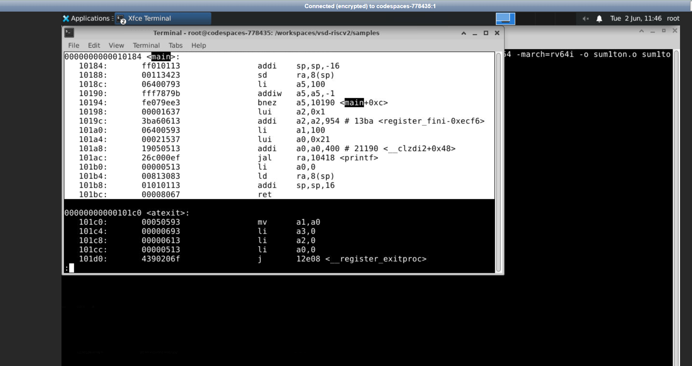

---

### Part A: Objdump `-Ofast`

#### Instruction Count Calculation (`sum1ton` `-Ofast`)

```
<main>            starts at : 0x100b0
<register_fini>   starts at : 0x100e0

Bytes  = 0x100e0 − 0x100b0 = 0x30 = 48 decimal
Count  = 48 ÷ 4 = 12 instructions
```

> **`sum1ton` with `-Ofast` uses 12 instructions in `main`**

#### Instruction-by-Instruction Walkthrough

| Address | Hex | Instruction | Explanation |
|---------|-----|-------------|-------------|
| `100b0` | `00001637` | `lui a2,0x1` | Load upper bits for sum constant |
| `100b4` | `00021537` | `lui a0,0x21` | Load upper bits for format string address |
| `100b8` | `ff010113` | `addi sp,sp,-16` | Allocate stack frame |
| `100bc` | `3ba60613` | `addi a2,a2,954` | Complete sum `5050 = 0x13ba` in `a2` — **entire loop eliminated** |
| `100c0` | `06400593` | `li a1,100` | Load `n=100` into `a1` |
| `100c4` | `18050513` | `addi a0,a0,384` | Complete format string address |
| `100c8` | `00113423` | `sd ra,8(sp)` | Save return address|
| `100cc` | `340000ef` | `jal ra,1040c <printf>` | Call printf |
| `100d0` | `00813083` | `ld ra,8(sp)` | Restore return address |
| `100d4` | `00000513` | `li a0,0` | Load return value 0 |
| `100d8` | `01010113` | `addi sp,sp,16` | Deallocate stack frame |
| `100dc` | `00008067` | `ret` | Return to caller |

> `objdump_sum_ofast.png` – Full objdump of sum1ton compiled with `-Ofast`

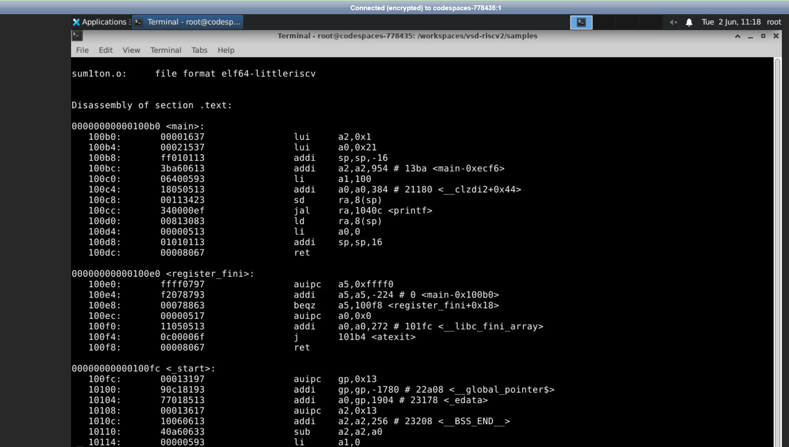

---

### Part A: SPIKE Debugger Walkthrough

```bash
spike -d pk sum1ton.o
(spike) until pc 0 10184     # Auto run till 10184 to start of main
(spike) reg 0 sp             # inspect stack pointer register
(spike) [Enter]              # execute next instruction
(spike) reg 0 a5             # inspect a5 after li a5,100
```

| Debugger Command | Explanation |
|---|---|
| `spike -d pk sum1ton.o` | Start Spike in interactive debug mode |
| `until pc 0 10184` | Auto-Run silently until program counter of core 0 reaches address `0x10184` (start of `main`) |
| `reg 0 sp` | Read the value of register `sp` on core 0 |
| `reg 0 a5` | Read the value of register `a5` on core 0 |
| `mem 0 7f7e9b48` | Read memory at address `0x7f7e9b48` on core 0 |
| `[Enter]` | Single-step: execute one instruction and show next |

**Key observations from debugger:**
- After `addi sp,sp,-16`: `sp` changes from `0x7f7e9b50` → `0x7f7e9b40` (decremented by 16)
- After `li a5,100`: `a5 = 0x0000000000000064` (100 in hex)
- After `addiw a5,a5,-1`: `a5 = 0x0000000000000063` (99 — the loop is counting down)
- `bnez a5, pc-4`: branche back, confirming the loop runs 100 times

> `debugger_o1.png` – Spike `-d` debugger stepping through sum1ton `-O1`

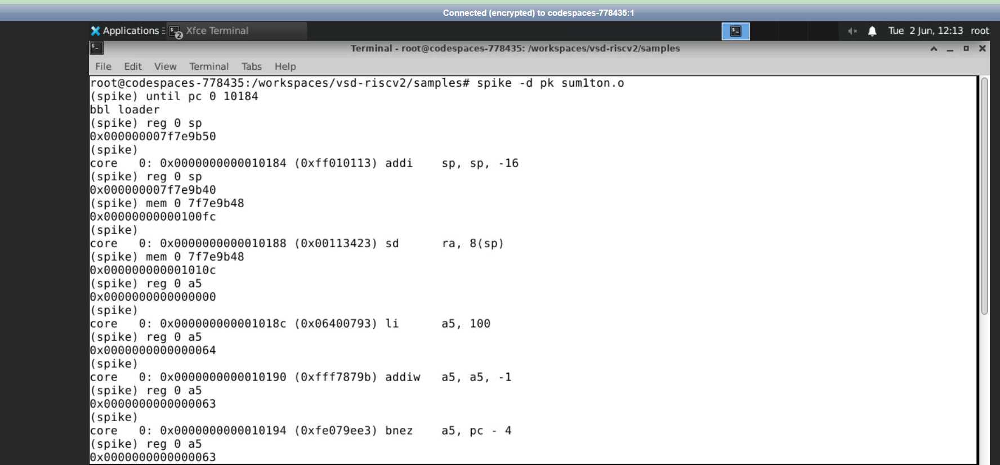

> `debugger_ofast.png` – Spike `-d` debugger stepping through sum1ton `-Ofast`

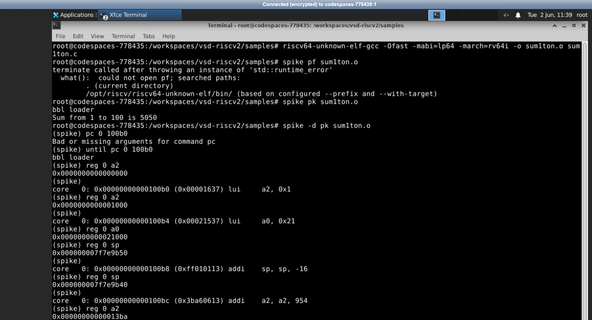

---

## Part B – Factorial Program (Custom Application)

### Part B: Source Code

The problem `nfact.c` computes the factorial of N using a countdown for loop.

```c
#include <stdio.h>

int main(){
    int n=5, i;
    int fact = 1;

    for(i=n; i>0; i--)
    {
        fact = fact*i;
    }
    printf("The factorial of %d is %d\n", n, fact);
}
```

**How it works:** Starting `i = n`, the loop multiplies `fact` by `i` and decrements `i` until `i = 0`. This computes `n! = n × (n-1) × ... × 1`.

**Expected results:**
- `n=5` → `5! = 120`
- `n=10` → `10! = 3628800`

> `c-code_fact.png` – `nfact.c` source code open in gedit editor

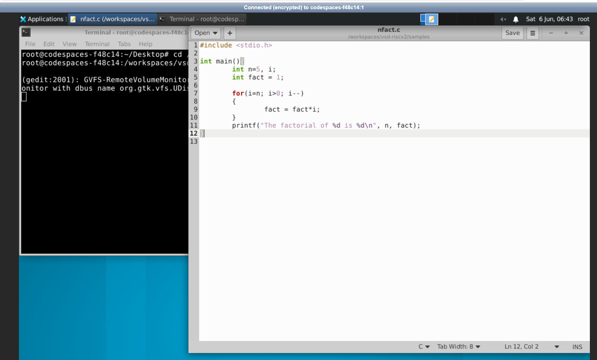

---

### Part B: GCC Compilation & Result

```bash
gedit nfact.c          # open in editor
gcc nfact.c            # compile with host GCC
./a.out                # run
```

**Output:** `The factorial of 5 is 120` ✅

> `result_gcc_n5_fact.png` – Host GCC compile and run: The factorial of 5 is 120

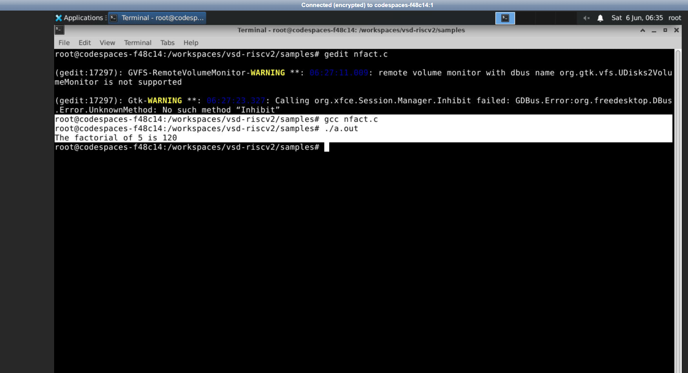

---

### Part B: RISC-V Compilation Commands

```bash
# Compile with -O1
riscv64-unknown-elf-gcc -O1 -mabi=lp64 -march=rv64i -o nfact.o nfact.c

# Then objdump
riscv64-unknown-elf-objdump -d nfact.o |less
```

```bash
# Compile with -Ofast
riscv64-unknown-elf-gcc -Ofast -mabi=lp64 -march=rv64i -o nfact.o nfact.c

# Then objdump
riscv64-unknown-elf-objdump -d nfact.o |less
```

> `objdump_fact_o1_cmd.png` – Terminal showing RISC-V compile + objdump command for factorial `-O1`

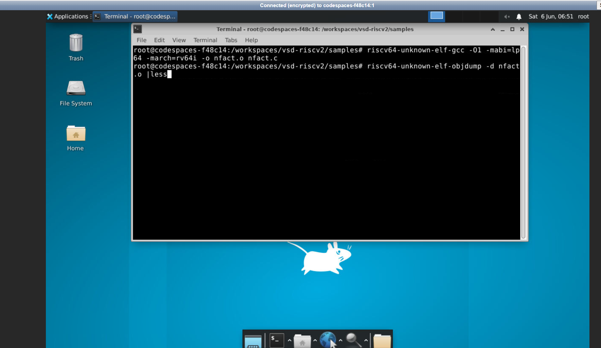

> `objdump_fact_ofast_cmd.png` – Terminal showing RISC-V compile + objdump command for factorial `-Ofast`

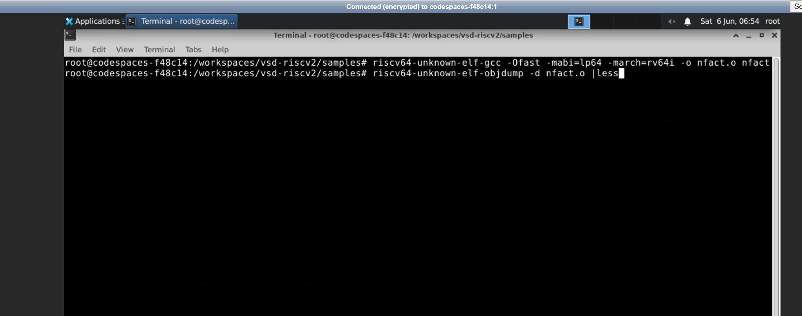

---

### Part B: SPIKE Simulation – Run

```bash
spike pk nfact.o
```

**Results verified on SPIKE:**

| n | Expected | SPIKE Output |
|---|----------|--------------|
| 5 | 120 | `The factorial of 5 is 120`  |
| 10 | 3628800 | `The factorial of 10 is 3628800` |

> `riscv_result-n5_fact_spike.png` – Spike run for factorial n=5: output 120

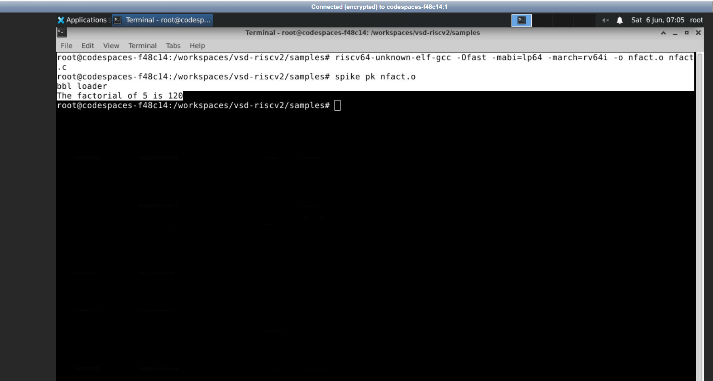

> `riscv_result-n10_fact_spike.png` – Spike run for factorial n=10: output 3628800

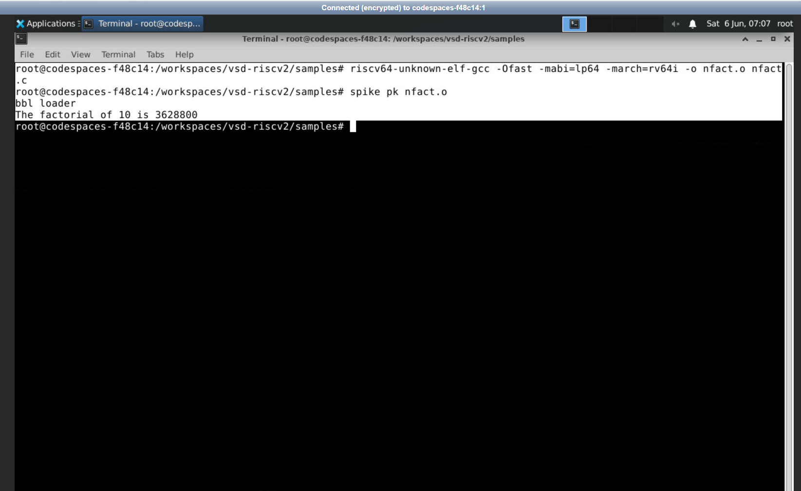

---

### Part B: Objdump `-O1`

```bash
riscv64-unknown-elf-gcc -O1 -mabi=lp64 -march=rv64i -o nfact.o nfact.c
riscv64-unknown-elf-objdump -d nfact.o | less
```

#### Instruction Count Calculation (`nfact` `-O1`)

From the objdump screenshot:

```
<main>   starts at : 0x10184
<atexit> starts at : 0x101b0   ← first instruction of next function

Bytes  = 0x101b0 − 0x10184 = 0x2c = 44 decimal
Count  = 44 ÷ 4 = 11 instructions
```

> **`nfact` with `-O1` uses 11 instructions in `main`**

#### Instruction-by-Instruction Walkthrough

| Address | Hex | Instruction | Explanation |
|---------|-----|-------------|-------------|
| `10184` | `ff010113` | `addi sp,sp,-16` | Allocate 16-byte stack frame |
| `10188` | `00113423` | `sd ra,8(sp)` | Save return address onto the stack |
| `1018c` | `07800613` | `li a2,120` | Load **pre-computed factorial result** `120` into `a2` — compiler folded `5!` at compile time! |
| `10190` | `00500593` | `li a1,5` | Load `n=5` into `a1` (printf 2nd arg) |
| `10194` | `00021537` | `lui a0,0x21` | Load upper 20 bits of format string address |
| `10198` | `18050513` | `addi a0,a0,384` | Complete format string address → `a0 = 0x21180` |
| `1019c` | `26c000ef` | `jal ra,10408 <printf>` | Call printf |
| `101a0` | `00000513` | `li a0,0` | Load return value 0 |
| `101a4` | `00813083` | `ld ra,8(sp)` | Restore return address from stack |
| `101a8` | `01010113` | `addi sp,sp,16` | Deallocate stack frame |
| `101ac` | `00008067` | `ret` | Return to caller |

**Key insight:** Even at `-O1`, the compiler performs **constant folding** — it knows `n=5` is a compile-time constant, evaluates `5! = 120` at compile time, and directly emits `li a2,120`. The entire `for` loop is gone even at `-O1`!

> `objdump_fact_o1.png` – Full objdump of nfact compiled with `-O1`

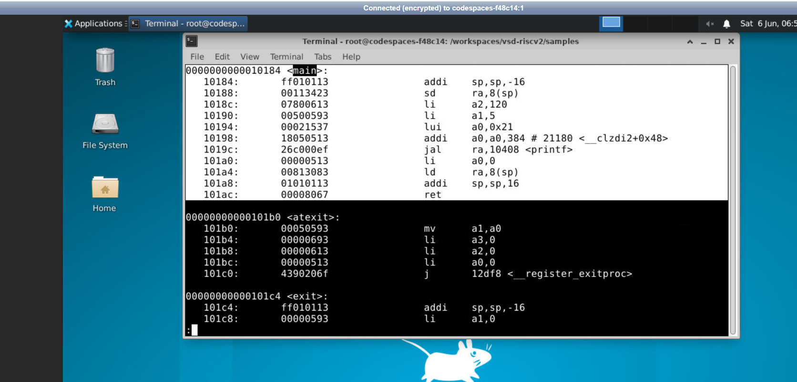

---

### Part B: Objdump `-Ofast`

```bash
riscv64-unknown-elf-gcc -Ofast -mabi=lp64 -march=rv64i -o nfact.o nfact.c
riscv64-unknown-elf-objdump -d nfact.o | less
```

#### Instruction Count Calculation (`nfact` `-Ofast`)

From the objdump screenshot:

```
<main>            starts at : 0x100b0
<register_fini>   starts at : 0x100dc   ← first instruction of next function

Bytes  = 0x100dc − 0x100b0 = 0x2c = 44 decimal
Count  = 44 ÷ 4 = 11 instructions
```

> **`nfact` with `-Ofast` uses 11 instructions in `main`** — same as `-O1`!

#### Instruction-by-Instruction Walkthrough

| Address | Hex | Instruction | Explanation |
|---------|-----|-------------|-------------|
| `100b0` | `00021537` | `lui a0,0x21` | Load upper 20 bits of format string address — instruction reordered |
| `100b4` | `ff010113` | `addi sp,sp,-16` | Allocate stack frame |
| `100b8` | `07800613` | `li a2,120` | Load pre-computed `5! = 120` directly (constant folding) |
| `100bc` | `00500593` | `li a1,5` | Load `n=5` into `a1` |
| `100c0` | `18050513` | `addi a0,a0,384` | Complete format string address |
| `100c4` | `00113423` | `sd ra,8(sp)` | Save `ra` — reordered by instruction scheduler |
| `100c8` | `340000ef` | `jal ra,10408 <printf>` | Call printf |
| `100cc` | `00813083` | `ld ra,8(sp)` | Restore return address |
| `100d0` | `00000513` | `li a0,0` | Load return value 0 |
| `100d4` | `01010113` | `addi sp,sp,16` | Deallocate stack frame |
| `100d8` | `00008067` | `ret` | Return to caller |

**Key insight:** `-Ofast` produces the **same 11 instructions** as `-O1` for the factorial program — because `-O1` already eliminated the loop via constant folding. The only difference is **instruction ordering**: `-Ofast` reorders `lui a0` and `sd ra` earlier for better pipeline utilization.

> `objdump_fact_ofast.png` – Full objdump of nfact compiled with `-Ofast`

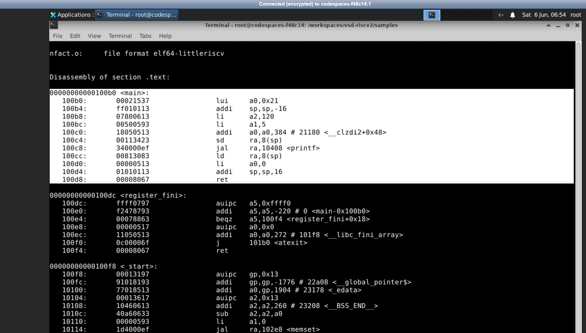

---

### Part B: SPIKE Debugger Walkthrough

```bash
# Debug with -O1 binary (run from start of main)
spike -d pk nfact.o
(spike) until pc 0 10184
(spike) reg 0 sp
(spike)                      # press Enter to step
(spike) reg 0 a2             # should show 0x78 = 120 after li a2,120
(spike) reg 0 a1             # should show 0x5 after li a1,5
(spike) reg 0 a0             # should show 0x21180 after address construction
```

```bash
# Debug with -Ofast binary
spike -d pk nfact.o
(spike) until pc 0 100b0
(spike) reg 0 a0
(spike)
(spike) reg 0 sp
```

**Register values observed in debugger (`-O1` run):**

| After Instruction | Register | Value | Meaning |
|---|---|---|---|
| `addi sp,sp,-16` | `sp` | `0x7f7e9b40` | Stack pointer decremented by 16 |
| `sd ra,8(sp)` | `mem[sp+8]` | `0x000...0100fc` | Return address saved to stack |
| `li a2,120` | `a2` | `0x0000000000000078` | `0x78 = 120 = 5!` |
| `li a1,5` | `a1` | `0x0000000000000005` | `n = 5` |
| `lui a0,0x21` | `a0` | `0x0000000000021000` | Upper bits of printf format string |
| `addi a0,a0,384` | `a0` | `0x0000000000021180` | Complete format string address |

> `debugger_fact_o1.png` – Spike `-d` debugger stepping through factorial `-O1`, showing `li a2,120` and register values

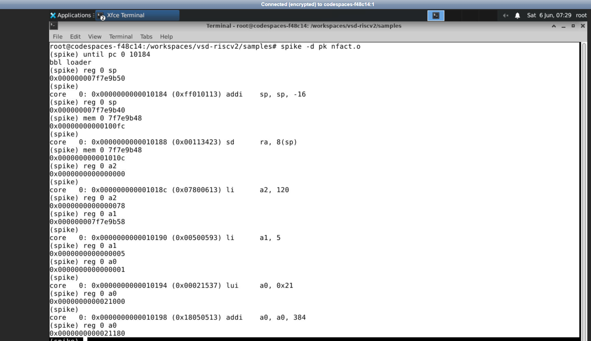

> `debugger_fact_ofast.png` – Spike `-d` debugger stepping through factorial `-Ofast`, showing instruction reordering

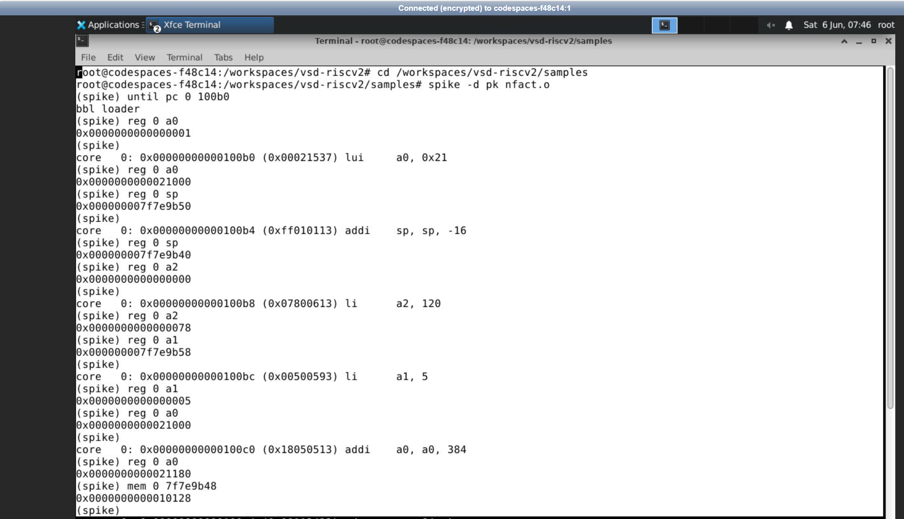

---

## Master Comparison Table

### Instruction Count Summary (All Programs × All Optimizations)

| Program | Optimization | `main` Start | Next Function Start | Bytes | Instructions |
|---------|-------------|--------------|---------------------|-------|--------------|
| `sum1ton` | `-O1` | `0x10184` | `0x101c0` (`<atexit>`) | `0x3c = 60` | **15** |
| `sum1ton` | `-Ofast` | `0x100b0` | `0x100e0` (`<register_fini>`) | `0x30 = 48` | **12** |
| `nfact` | `-O1` | `0x10184` | `0x101b0` (`<atexit>`) | `0x2c = 44` | **11** |
| `nfact` | `-Ofast` | `0x100b0` | `0x100dc` (`<register_fini>`) | `0x2c = 44` | **11** |

### Address Calculation Recap

```
sum1ton -O1  :  0x101c0 − 0x10184 = 0x3c  = 60  bytes → 60 ÷ 4 = 15 instructions
sum1ton -Ofast: 0x100e0 − 0x100b0 = 0x30  = 48  bytes → 48 ÷ 4 = 12 instructions

nfact   -O1  :  0x101b0 − 0x10184 = 0x2c  = 44  bytes → 44 ÷ 4 = 11 instructions
nfact   -Ofast: 0x100dc − 0x100b0 = 0x2c  = 44  bytes → 44 ÷ 4 = 11 instructions
```

### Key Behavioral Differences

| Feature | `sum1ton -O1` | `sum1ton -Ofast` | `nfact -O1` | `nfact -Ofast` |
|---------|--------------|-----------------|-------------|----------------|
| Loop present | Yes (countdown) | No | No | No |
| Constant folding | Partial | Full | Full | Full |
| Result pre-loaded | `5050` via `lui+addi` pair | `5050` via `lui+addi` pair | `120` via `li a2,120` | `120` via `li a2,120` |
| Instruction scheduling | Sequential | Reordered | Sequential | Reordered |
| Instruction count | 15 | 12 | 11 | 11 |

---

## Screenshots Index

| Image File | Description |
|-----------|-------------|
| `sum-1ton_c-code.png` | `sum1ton.c` source code in gedit (n=100) |
| `result-1_sum.png` | GCC compile+run for sum1ton: output 5050 |
| `objdump_sum_o1_cmd.png` | Terminal: RISC-V compile + objdump command for sum1ton `-O1` |
| `objdump_sum_ofast_cmd.png` | Terminal: RISC-V compile + objdump command for sum1ton `-Ofast` |
| `objdump_sum_o1.png` | Objdump disassembly of sum1ton `-O1` — 15 instructions |
| `objdump_sum_ofast.png` | Objdump disassembly of sum1ton `-Ofast` — 12 instructions |
| `riscv_result-n100_spike.png` | Spike simulation of sum1ton: `Sum from 1 to 100 is 5050` |
| `riscv_result-n50_spike.png` | Spike simulation of sum1ton: `Sum from 1 to 50 is 1275` |
| `debugger_o1.png` | Spike `-d` debugger session for sum1ton `-O1` |
| `debugger_ofast.png` | Spike `-d` debugger session for sum1ton `-Ofast` |
| `c-code_fact.png` | `nfact.c` source code in gedit (n=5) |
| `result_gcc_n5_fact.png` | GCC compile+run for nfact: output 120 |
| `objdump_fact_o1_cmd.png` | Terminal: RISC-V compile + objdump command for nfact `-O1` |
| `objdump_fact_ofast_cmd.png` | Terminal: RISC-V compile + objdump command for nfact `-Ofast` |
| `objdump_fact_o1.png` | Objdump disassembly of nfact `-O1` — 11 instructions |
| `objdump_fact_ofast.png` | Objdump disassembly of nfact `-Ofast` — 11 instructions |
| `riscv_result-n5_fact_spike.png` | Spike simulation of nfact n=5: output 120 |
| `riscv_result-n10_fact_spike.png` | Spike simulation of nfact n=10: output 3628800 |
| `debugger_fact_o1.png` | Spike `-d` debugger session for nfact `-O1` |
| `debugger_fact_ofast.png` | Spike `-d` debugger session for nfact `-Ofast` |

---

## Learnings

### 1. What is SPIKE and the Proxy Kernel?
**SPIKE** is a RISC-V ISA reference simulation tool. The Spike simulation environment runs a fully simulated RISC-V 64-bit processor. RISC-V executable binaries are not native to the x86 processor architecture and need the Spike environment to execute.

**Proxy Kernel (`pk`)** is a minimal operating system that deals with system calls (`write`, for example, invoked internally by `printf`) by passing them to the underlying host operating system. Otherwise, the bare metal code will fail when trying to print since there is no operating system to handle the call.

```
[Your C Program] -> printf() -> syscall -> pk captures -> pass to host Linux -> prints
```

### 2. How Spike `-d` (Debugger Mode) Works
The `-d` command initiates the Spike environment into a mode where it works as an **interactive debugger** much like GDB but for the RISC-V simulation environment:

| Command | Description |
| --- | --- |
| `until pc 0 ADDR` | Execute silently until PC of core 0 is `ADDR` |
| `reg 0 REGNAME` | Display the value in register `REGNAME` of core 0 |
| `mem 0 ADDR` | Display the contents of memory `ADDR` of core 0 (8 bytes) |
| `[enter]` | Execute just one instruction then display the next one |
| `q` | Quit debugging |

Using this, one can get an insight into how every register and every byte in memory changes upon execution of every instruction.

### 3. Constant Folding in the Factorial Program
The example of **constant folding** can be observed in the factorial program. Since both `n=5` and `fact=1` are compile-time constants, the compiler evaluates the entire loop **at compile time**, thus yielding:
```
fact = 1 × 5 × 4 × 3 × 2 × 1 = 120
```
Consequently, the output is just one line of code – `li a2,120`. Hence, there is no difference between `-O1` and `-Ofast` regarding `nfact` instruction count (11).

### 4. Why Does `sum1ton` Yield a Loop but `nfact` Does Not?
- `sum1ton -O1`: Even though the compiler retains the loop, consisting of two instructions (`addiw` and `bnez`), it still manages to compute the constant. This appears strange, as the loop does run, yet it does not affect the number that gets printed (`li a2,5050`). When using `-Ofast`, the compiler manages to eliminate the loop completely
- `nfact -O1`: Since the computation involves constant multiplication, constant folding is applied more extensively than in the previous example; hence, the compiler eliminates the loop even at `-O1`
- Therefore, it can be seen that **optimizations depend on the computation performed**

### 5. Instruction Reordering by `-Ofast`
By comparing the use of `-O1` and `-Ofast` optimizations in identical source codes, `-Ofast` performs **instruction reordering** to optimize the pipeline efficiency:
- Under `-O1`, `addi sp,sp,-16` (stack pointer adjustment) happens first, followed by `sd ra,8(sp)` (ra register storage)
- Under `-Ofast`, `-Ofast` places independent instructions such as `lui a0,0x21` before stack pointer adjustment, so that the loading/storing pipeline is not stalled waiting for the completion of stack pointer adjustment 

### 6. `bbl loader` Message
Each Spike + pk execution is preceded by a `bbl loader` message. This message comes from the **Berkeley Boot Loader** which is simply informing you that it is starting up as part of the Spike initialization sequence.
### 7. Verification: Host GCC vs. SPIKE Must Match
A critical check is that the output of `gcc` on the host must equal the output of `spike pk` on the RISC-V binary:

| Program | GCC (x86) | Spike (RISC-V) | Match? |
|---------|-----------|----------------|--------|
| sum1ton (n=100) | `5050` | `5050` | Yes |
| sum1ton (n=50) | `1275` | `1275` | Yes|
| nfact (n=5) | `120` | `120` | Yes|
| nfact (n=10) | `3628800` | `3628800` | Yes|

---

## Conclusion

Task 2 successfully demonstrated the complete RISC-V simulation and debugging workflow using the Spike ISA simulator.

### What Was Accomplished

**For `sum1ton.c` (Spike):**
- RISC-V binary verified to be correct by executing `spike pk sum1ton.o`; output `5050` for n=100 and `1275` for n=50, the same as GCC
- Address calculations verified: `-O1` results in **15 instructions**, `-Ofast` gives **12 instructions** (20% less than `-O1`)
- Verified through `spike -d`, with values in registers `a5` decrementing from `100 -> 99 -> ... -> 0`

**For `nfact.c` (custom application):**
- Factorials of 5 and 10 = 120 and 3628800 are verified in GCC and Spike respectively
- Address calculations confirmed: `-O1` and `-Ofast` result in **11 instructions**
- Factoring loop eliminated entirely using **constant folding**, even at `-O1` optimization level
- No other difference other than instruction scheduling between `-O1` and `-Ofast` outputs
- Verified in debugger, where `li a2,120` results in `0x78 = 120` loaded

### Final Instruction Count Summary

```
sum1ton -O1  :  0x101c0 − 0x10184 = 60 bytes →  15 instructions
sum1ton -Ofast: 0x100e0 − 0x100b0 = 48 bytes →  12 instructions  (20% reduction)

nfact   -O1  :  0x101b0 − 0x10184 = 44 bytes →  11 instructions
nfact   -Ofast: 0x100dc − 0x100b0 = 44 bytes →  11 instructions  (0% reduction — already optimal)
```
---
