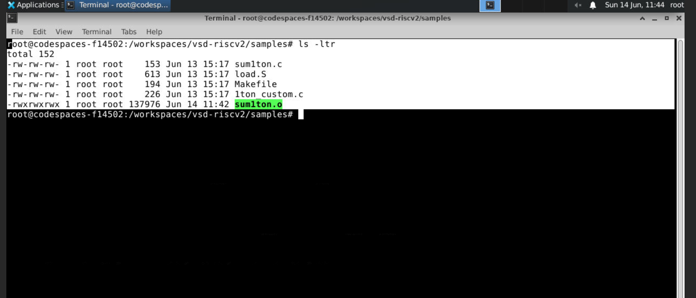
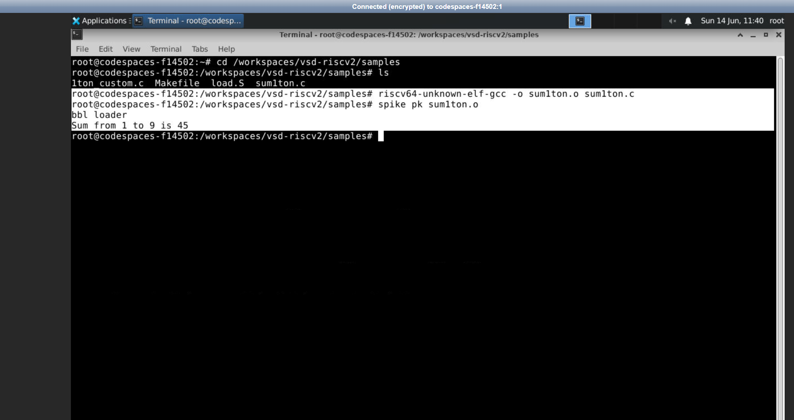
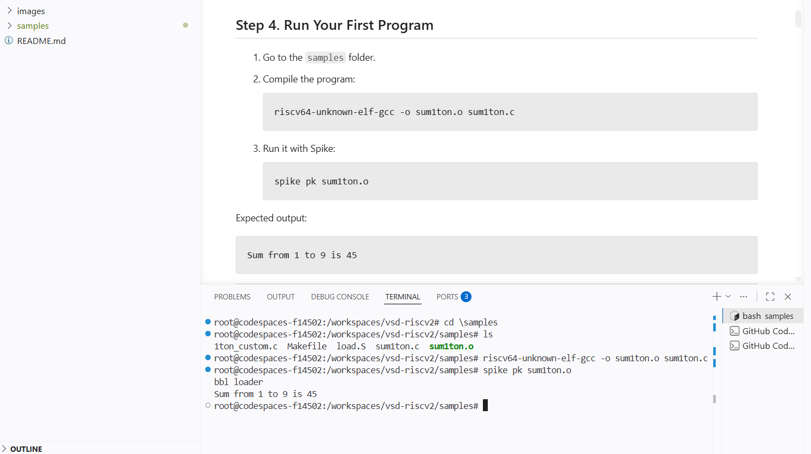
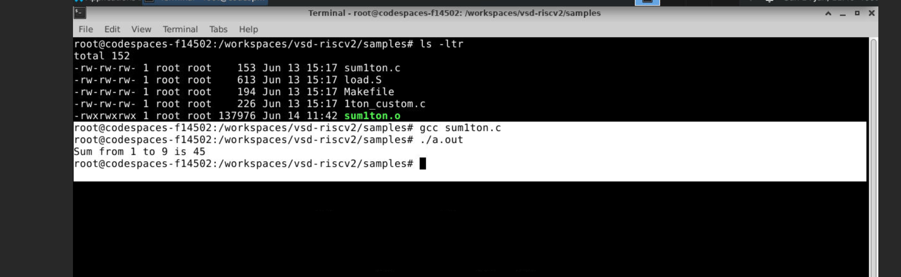
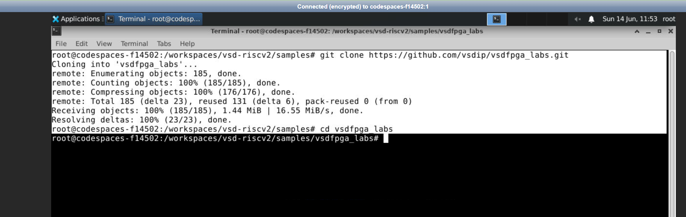
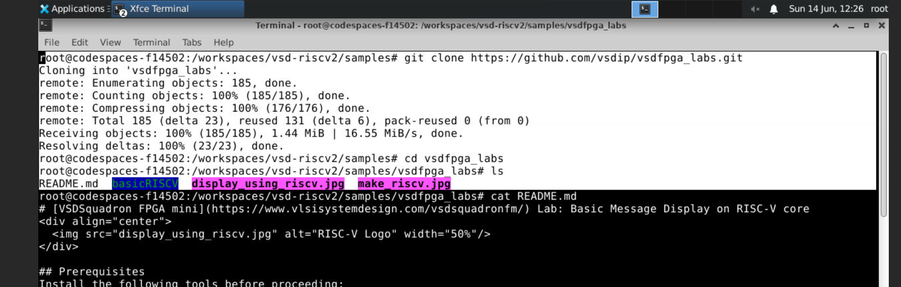
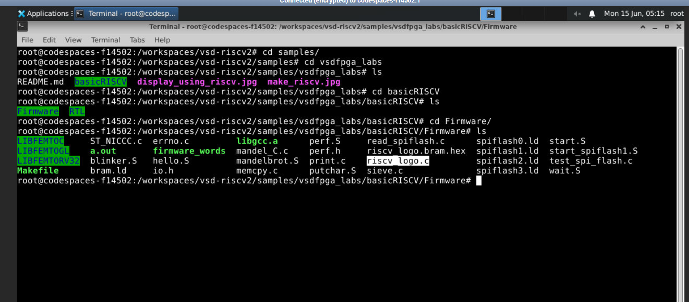
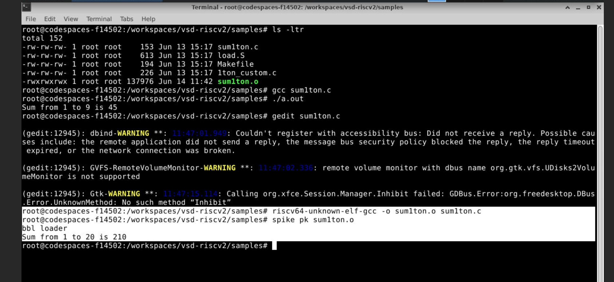

# Task: Environment Setup & RISC-V Reference Bring-Up

This exercise helps to create a common development baseline. Toolchain preparation, understanding the RISC-V execution flow, and preparation for future FPGA/IP development exercises are part of the objectives of this task.

---

## Table of Contents

1. [Objective](#objective)
2. [Step 1 – GitHub Codespace Setup](#step-1--github-codespace-setup)
3. [Step 2 – RISC-V Reference Flow Verification](#step-2--risc-v-reference-flow-verification)
4. [Step 3 – Clone & Run VSDFPGA Labs](#step-3--clone--run-vsdfpga-labs)
5. [Step 4 – Local Machine Preparation](#step-4--local-machine-preparation)
6. [Optional Confidence Task](#optional-confidence-task)
7. [Understanding and Answer Q&A](#understanding-check--qa)
8. [Screenshots Index](#screenshots-index)

---

## Objective

- Configure the development environment through the **vsd-riscv2** GitHub Codespace 
- Execute the **RISC-V example programm** (`sum1ton.c`) via `spike pk` 
- Clone and examine the **VSDFPGA labs** Git repository within the same Codespace
- Examine the Dockerfile for configuring our own environment 
- Answer four comprehension questions related to the RISC-V execution process

**Environment used:** GitHub Codespace (`codespaces-f14502`)

---

## Step 1 – GitHub Codespace Setup

Forked the [vsd-riscv2](https://github.com/vsdip/vsd-riscv2) repository and created a GitHub Codespace. The Codespace was created successfully and contained all necessary tools already installed, such as the RISC-V toolchain and observing hrdware tools.

**Repository path in `/workspaces/vsd-riscv2/samples`:**

```bash
cd /workspaces/vsd-riscv2/samples
ls -ltr
```

Files present:
- `sum1ton.c` — RISC-V reference program
- `load.S` — assembly loader file
- `Makefile` — build system
- `1ton_custom.c` — custom 
- `sum1ton.o` — compiled RISC-V program (after compilation)

> `gcc_sum1ton_o_verification.png` — `ls -ltr` output showing `sum1ton.o` (137976 bytes) after compilation



---

## Step 2 – RISC-V Reference Flow Verification

### Step 2a – Reference Run (original `sum1ton.c`, n=9)

The repository's original `sum1ton.c` has `n=9`. By following the README instructions:

```bash
cd /workspaces/vsd-riscv2/samples
ls
riscv64-unknown-elf-gcc -o sum1ton.o sum1ton.c
spike pk sum1ton.o
```

**Output:**
```
bbl loader
Sum from 1 to 9 is 45
```

RISC-V reference program ran successfully — matches expected output from the repository README content .

> `RISCV_reference_n9_sum1ton.png` — RISC-V compile + Spike run: `Sum from 1 to 9 is 45`



> `riscv_compilation_output.png` — VS Code (git hub) terminal showing Step 4 from vsd-riscv2 README with compile command and `Sum from 1 to 9 is 45` which is the output



### Step 2b – Host GCC Verification (n=9)

To confirm problem logic independently on the VNC machine:

```bash
gcc sum1ton.c
./a.out
```

**Output:** `Sum from 1 to 9 is 45` 

> `gcc_sum1ton_output.png` — Host GCC compile and run output: `Sum from 1 to 9 is 45`



### Command Explanation

| Command                     | Explanation                                          |
|----------------------------|-----------------------------------------------------|
| riscv64-unknown-elf-gcc -o sum1ton.o sum1ton.c    | Compile sum1ton.c for RISC-V 64-bit with default flags but without the optimization flag(-O) |
| spike pk sum1ton.o         | Execute the compiled RISC-V ELF file using Spike ISA simulator with Proxy Kernel |
| bbl loader                 | Message shown on the start of Berkeley Boot Loader by the proxy kernel |

---

## Step 3 – Clone & Run VSDFPGA Labs

### Step 3a – Clone the repository

```bash
cd /workspaces/vsd-riscv2/samples
git clone https://github.com/vsdip/vsdfpga_labs.git
cd vsdfpga_labs
ls
```

**Clone output:**
```
Cloning into 'vsdfpga_labs'...
remote: Enumerating objects: 185, done.
remote: Counting objects: 100% (185/185), done.
remote: Compressing objects: 100% (176/176), done.
remote: Total 185 (delta 23), reused 131 (delta 6), pack-reused 0 (from 0)
Receiving objects: 100% (185/185), 1.44 MiB | 16.55 MiB/s, done.
Resolving deltas: 100% (23/23), done.
```

**Contents of `vsdfpga_labs` folder:**
```
README.md   basicRISCV/   display_using_riscv.jpg   make_riscv.jpg
```

> `VSDFPGA_repository_clone.png` — Terminal of machine which shows successful `git clone` of vsdfpga_labs (185 objects, 1.44 MiB)



### Step 3b – Review the README File

```bash
cat README.md
```

The README provides the **VSDSquadron FPGA mini** lab for Basic Message Display on a RISC-V core, and lists prerequisites including RISC-V toolchain and supporting fpga tools.

> `VSDFPGA_README_REVIEW.png` — Terminal showing `cat README.md` output with lab description 



### Step 3c – Explore the RISCV Program workspace in clone directory (Path of Q1)

```bash
cd basicRISCV
ls
```
```
Firmware/   RTL/
```

```bash
cd Firmware
ls
```

**Key files identified:**

| File Name         | Purpose                                               |
|-------------------|-------------------------------------------------------|
| riscv_logo.c      | Main RISC-V Application code                          |
| riscv_logo.bram.hex| Firmware hex code, used in BRAM                     |
| Makefile          | Build system, which builds the firmware               |
| start.S           | Startup / reset assembly code                         |
| bram.ld           | Linker file specifying memory layout in BRAM          |
| libgcc.a          | Pre-built GCC library for RISC-V architecture        |
| LIBFEMTOC, LIBFEMTOGL, LIBFEMTORV32   | Components of Femto Library     |
| firmware_words    | Utility program for firmware words                    |
| io.h              | Memory mapped I/O definitions header                  |

> `RISCV_program_VSDFPGA.png` — Terminal showing directory navigation of RISCV program into `basicRISCV/Firmware/` including `riscv_logo.c` and `riscv_logo.bram.hex`



---

## Step 4 – Local Machine Preparation

Reviewed the provided Dockerfile at:
`https://raw.githubusercontent.com/vsdip/vsd-riscv2/refs/heads/main/.devcontainer/Dockerfile`

Review of the provided Dockerfile and identification of necessary development software, RISC-V toolchain tools, simulator tools, and packages. The Dockerfile served as a basis for setting up the local environment in the future. 

- **RISC-V toolchain:** `riscv64-unknown-elf-gcc`, `riscv64-unknown-elf-objdump`, binutils
- **Simulation tools:** Spike ISA simulator, proxy kernel (`pk`)
- **Supporting packages:** `git`, `make`, `build-essential`, standard development libraries


---

## Optional Confidence Task

Modified `sum1ton.c` to change `n` from `9` to `20`, then recompiled and re-ran on both host GCC and RISC-V/Spike to check the terminal output and changes in it.

### Source Code (modified, n=20)

```c
#include <stdio.h>

int main(){
    int i, sum=0, n=20;
    for(i=1;i<=n;i++)
        sum = sum + i;
    printf("Sum from 1 to %d is %d \n",n,sum);
    return 0;
}
```

> `C_code_n20_sum1ton_c.png` — `sum1ton.c` with `n=20` open in gedit editor


### Commands run

```bash
# Re-compile for RISC-V and run on Spike
gedit sum1ton.c                                      # edit n to 20
riscv64-unknown-elf-gcc -o sum1ton.o sum1ton.c       # recompile
spike pk sum1ton.o                                   # re-run
```

**Output:**
```
bbl loader
Sum from 1 to 20 is 210
```

Changed output confirms toolchain is fully working and there is no error in it — Which shows rebuild and re-execution successful.

> `riscv_n20_sum1ton_outut.png` — Terminal showing recompil and Spike run after changing `n=20`: output `Sum from 1 to 20 is 210`



---

## Understanding  – Q&A

### Q1. Where is the RISC-V program located in the vsd-riscv2 repository?

The RISC-V  application program in the VSDFPGA lab `basicRISCV` is available here:
```
workspaces/vsd-riscv2/samples/vsdfpga_labs/basicRISCV/Firmware/riscv_logo.c
```
And Sorce code in vsd-riscv2 workspace is 
```
workspaces/vsd-riscv2/samples/sum1ton.c
```
This C application file has the RISC-V logo application. During the compile stage, it is built into an executable image file named `riscv_logo.bram.hex`, which is then uploaded to and run by the RISC-V memory. And in sum1ton.c source file, when it is compiled output is stored in `sum1ton.o` which then run using both gcc and riscv approach.

---

### Q2. How is the program compiled and loaded into memory?

This code (`riscv_logo.c` and `sum1ton.c`) is being compiled by using RISC-V compiler (`riscv64-unknown-elf-gcc`). Once this code gets compiled into an executable, then logo file gets further translated into a memory initialization file (`riscv_logo.bram.hex`) and sorce code gets translated to output file (`sum1ton.o`).
---

### Q3. How does the RISC-V core access memory and memory-mapped IO?

In RISC-V architecture, memory and peripherals use the same address space. The program and its data are loaded from the BRAM, but any accesses to the peripherals will be done via memory mapped registers, e.g. for the UART interface. If the CPU tries to access a peripheral register, the hardware block serves the request to host.

---

### Q4. Where would a new FPGA IP block logically integrate in this system?

This new FPGA IP core would be incorporated into the design as a memory mapped peripheral attached to the system bus. The address decoder would then give it an address space that is uniquely identified, and communication between the processor and it would be via memory read/write instructions.

---

## Screenshots Index

| Image File Name | Description of Image |
|-----------------|--------------------|
| `C_code_n20_sum1ton_c.png` | Source code for `sum1ton.c` with `n=20` in gedit |
| `gcc_sum1ton_o_verification.png` | Output of `ls -ltr` command showing compiled binary file `sum1ton.o` with size 137976 bytes |
| `gcc_sum1ton_output.png` | Run of `sum1ton` on host using gcc compile: `Sum from 1 to 9 is 45` |
| `riscv_compilation_output.png` | Screenshot from VS Code terminal with Step 4 of README completed: compilation and `spike pk sum1ton.o` showing output `Sum from 1 to 9 is 45` |
| `riscv_n20_sum1ton_outut.png` | Spike run with `n=20` changed: `Sum from 1 to 20 is 210` |
| `RISCV_program_VSDFPGA.png` | Navigation to `basicRISCV/Firmware/` directory and files `riscv_logo.c` and `riscv_logo.bram.hex` |
| `RISCV_reference_n9_sum1ton.png` | RISC-V Cross-Compile with Spike : `Sum from 1 to 9 is 45` |
| `VSDFPGA_README_REVIEW.png` | `git clone` + `cat README.md` Output from vsdfpga_labs |
| `VSDFPGA_repository_clone.png` | `git clone` Output 

---

## Learnings-

- **GitHub Codespaces as development environment** — This predefined cloud-based Codespaces environment takes care of local installation process, making sure all students work within the same framework right from the start.
- **Cross Compilation Setup** — In this process, `riscv64-unknown-elf-gcc` is used on the host architecture (x86), but generates binary for the RISC-V architecture. Here again, the resultant file is not executable on the host system; only in a simulated or real environment.
- **Firmware load using BRAM** — Under the VSDFPGA methodology, the generated C code is compiled to a `.bram.hex` format and loaded into BRAM beforehand. The RISC-V core executes code directly from BRAM.
- **Memory mapped I/O** — Devices such as UART are assigned addresses from the same address space used by memory. An address decoder assigns a specific range of addresses for each device, pointing to the corresponding hardware module.
- **Flow confirmation through re-building** — Changing `n` to 20 from 9 while obtaining a successful `210` result from edit to compiling to Spike confirmed that all parts of the flow, from the editor to compiler and simulator.

---

## Conclusion-

The task was completed successfully using all four steps. No problems arose during the use of the GitHub Codespace as it gave us a fully functional RISC-V development environment. The reference file `sum1ton.c` compiled and run successfully in the host GCC environment with the output `Sum from 1 to 9 is 45` and Spike RISC-V simulator, which again gave the same result. The `vsdfpga_labs` repository was cloned and analyzed, and the required file `basicRISCV/Firmware/` containing `riscv_logo.c` and `riscv_logo.bram.hex` were recognized. An additional step consisted of changing the value of `n` to 20 and getting the result `Sum from 1 to 20 is 210`.

---
