# Task-2: Design & Integration of  First Memory-Mapped IP GPIO

This task moves from environmental setup to actual IP design, which involves designing a simple memory-mapped GPIO Output IP, implementing it in the already designed RISC-V SoC, and verifying it by simulation using iverilog and synthesise it.

---

## Table of Contents

1. [Objective](#objective)
2. [IP Specification](#ip-specification)
3. [Understanding the Existing SoC](#understanding-the-existing-soc)
4. [GPIO IP RTL Design](#gpio-ip-rtl-design)
5. [SoC Integration](#soc-integration)
6. [Firmware & Simulation Validation](#firmware--simulation-validation)
7. [Hardware Build Flow (Optional)](#hardware-build-flow-optional)
8. [Complete Write & Read Data Flow](#complete-write--read-data-flow)
9. [Signal Glossary](#signal-glossary)
10. [Screenshots Index](#screenshots-index)
11. [Learnings](#learnings)
12. [Conclusion](#conclusion)

---

## Objective

Implement a basic memory-mapped IP, add it to the existing RISC-V SoC, and test it via simulation – following the exact procedure a typical engineer will take when implementing his first custom peripheral on the SoC bus. By writing GPIO ip and testing module verify functionality.Synthesising it using yosys.

**IP implemented:** Simple GPIO Output IP (write only, read back)
**Environment:** GitHub Codespace (`codespaces-f14502`), `vsd-riscv2/samples/vsdfpga_lab/basicRISCV/RTL

---

## IP Specification

| Feature | Value |
|---|---|
| **Purpose/Function** | Single 32-bit register. Write operation modifies the value of the output signal. Read retrieves the previous value written. |
| **Interface** | Memory mapped, and is connected to the existing CPU bus, making use of the bus signals that already exist in the SoC. |
| **Base Address** | `IO_BASE = 0x400000` |
| **GPIO Offset** | `IO_GPIO = 32` (Word address 32 translates to bit position 3) |

---

## Understanding the Existing SoC

The architecture of the RISC-V SoC system is reviewed to gain insight into the connections between the processor, memory, and peripherals. The I/O memory mapped method and the address decoding circuitry is valued to have an understanding of how the peripherals interact with the processor. The UART peripheral and the memory access process were also analyzed.
### `io.h` — Firmware-side address map

```c
#include <stdint.h>

#define IO_BASE        0x400000
#define IO_LEDS        4
#define IO_UART_DAT    8
#define IO_UART_CNTL   16
#define IO_GPIO        32 // gpio address offset

#define IO_IN(port)       *(volatile uint32_t*)(IO_BASE + port)
#define IO_OUT(port,val)  *(volatile uint32_t*)(IO_BASE + port)=(val)
```

This header file specifies the **memory-mapped I/O address mapping** for the SoC. The `IO_BASE` is the base address for the peripheral space, where each peripheral – LEDs, UART data, UART control, and GPIO – is placed at an offset in the peripheral space. `IO_IN` and `IO_OUT` are macros that deference a `volatile` pointer to `IO_BASE + offset`. It is very important to make the pointer volatile because the value can be changed by hardware.

> `GPIO_address_def.png` — `io.h` showing the added `IO_GPIO` offset (32) added alongside existing `IO_LEDS`, `IO_UART_DAT`, `IO_UART_CNTL`

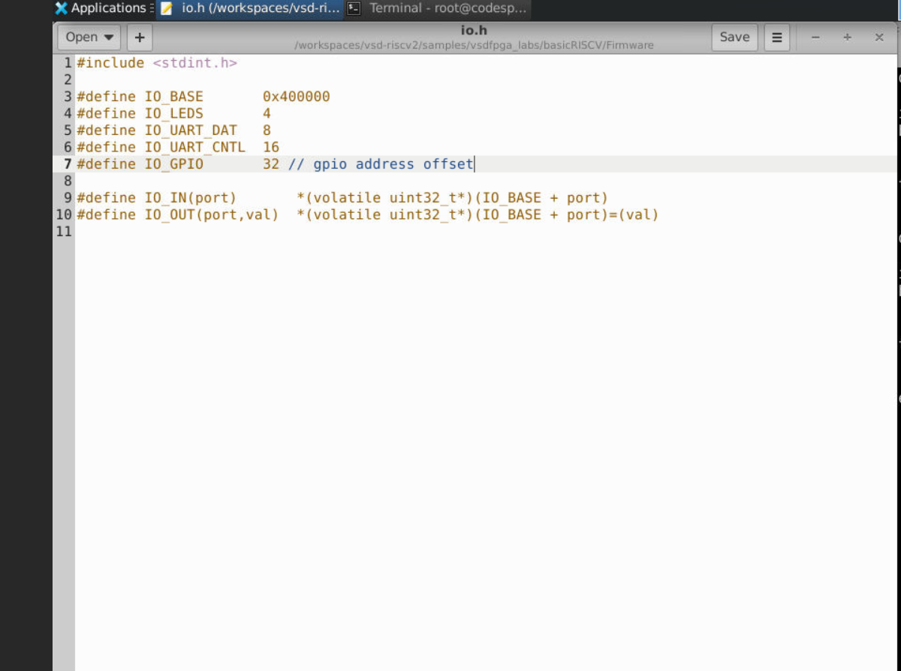

### `riscv.v` — SoC top-level decode logic

```verilog
wire [29:0] mem_wordaddr = mem_addr[31:2];
wire isIO  = mem_addr[22];
wire isRAM = !isIO;
wire mem_wstrb = |mem_wmask;

Memory RAM(
   .clk(clk),
   .mem_addr(mem_addr),
   .mem_rdata(RAM_rdata),
   .mem_rstrb(isRAM & mem_rstrb),
   .mem_wdata(mem_wdata),
   .mem_wmask({4{isRAM}}&mem_wmask)
);

// Memory-mapped IO in IO page, 1-hot addressing in word address.
localparam IO_LEDS_bit      = 0;
localparam IO_UART_DAT_bit  = 1;
localparam IO_UART_CNTL_bit = 2;
```

**Key findings:**
- Address bit `mem_addr[22]` (`isIO`) differentiates the IO peripheral region from the RAM region – which is the **highest-level address decoding**.
- Peripheral devices will be selected based on **bit addressing** in the word address (`mem_wordaddr`) – the peripheral device owns its bit position (`IO_LEDS_bit=0`, `IO_UART_DAT_bit=1`, `IO_UART_CNTL_bit=2`) rather than an address comparison.
- The current LED peripheral is the most basic one: `if(isIO & mem_wstrb & mem_wordaddr[IO_LEDS_bit]) LEDS <= mem_wdata;` – simple register assignment, not a separate IP core.
- The UART peripheral will be another independent IP core (`corescore_emitter_uart`) implemented in `riscv.v` via `uart_valid`, `uart_ready`, like the new GPIO IP core.

### Directory structure explored

```bash
cd /workspaces/vsd-riscv2/samples/vsdfpga_labs/basicRISCV/RTL
ls
```
```
Makefile    SOC.json   clockworks.v   firmware.hex   riscv.v
SOC.asc     SOC.timings emitter_uart.v firmware.txt   obj_dir
SOC.bin     VSDSquadronFM.pcf  femtopll.v
```

> `UART_RTL_directory.png` — Terminal listing of the `RTL/` directory showing `riscv.v` (SoC top-level), `emitter_uart.v` (existing UART IP), and synthesis output files.

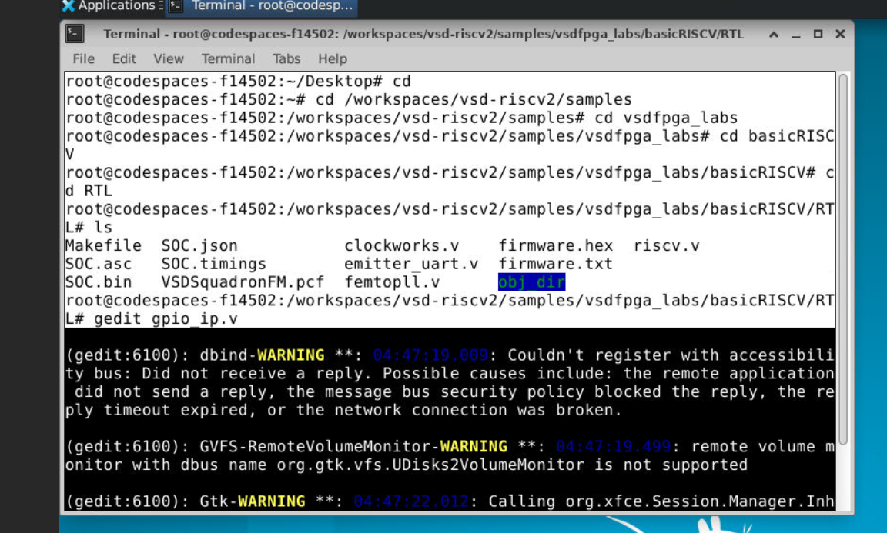

---

## GPIO IP RTL Design

A new RTL module `gpio_ip.v` is created which implement the GPIO IP specification: register storage, write logic, and readback logic, following synchronous design principles.

```verilog
module gpio_ip (
        input clk,
        input rst,
        input write_en, // To enable write operation
        input [31:0] w_data, // data to be written
        output [31:0] r_data, // data to be accessed
        output [31:0] gpio_out);

        reg [31:0] gpio_reg;

        always @(posedge clk) begin
                if(rst)
                        gpio_reg <= 32'd0;
                else if(write_en)
                        gpio_reg <= w_data;
        end

        assign gpio_out = gpio_reg;
        assign r_data = gpio_reg;
endmodule
```

### Code explanation
| Part | Description |
|---|---|
| `input write_en` | Write enable that is asserted only by the SoC decoder on a valid GPIO write |
| `input [31:0] w_data` | Data input for writing to the GPIO module, a 32-bit data bus |
| `output [31:0] r_data` | Readback output, reflecting the value in the register at all times |
| `output [31:0] gpio_out` | GPIO output signal (would be connected to LEDs/pins if necessary) |
| `reg [31:0] gpio_reg` | Single 32-bit register needed to implement the design |
| `assign r_data = gpio_reg` | Readback assignment that allows reading back the content of the register |


> `Gpio_IP_code.png` — `gpio_ip.v` open in gedit showing the complete module

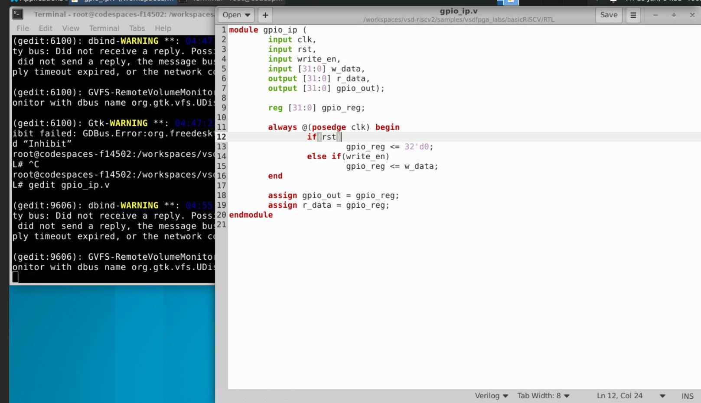

---

## SoC Integration

The GPIO IP was instantiated in the SoC top-level of (`riscv.v`), with address decoding added and bus signals connected and verify it.

### Step 3a – New address bit and write-enable signal

```verilog
// Memory-mapped IO in IO page, 1-hot addressing in word address.
localparam IO_LEDS_bit      = 0;  // W five leds
localparam IO_UART_DAT_bit  = 1;  // W data to send (8 bits)
localparam IO_UART_CNTL_bit = 2;  // R status. bit 9: busy sending
localparam IO_GPIO_bit      = 3;  // adding gpio address bit to peripheral

wire uart_valid = isIO & mem_wstrb & mem_wordaddr[IO_UART_DAT_bit];
wire uart_ready;
wire gpio_write;
wire [31:0] gpio_rdata;
wire [31:0] gpio_out;

assign gpio_write = isIO & mem_wstrb & mem_wordaddr[IO_GPIO_bit]; // to enable gpio write operation
```

A new `localparam IO_GPIO_bit = 3` was introduced to complement the current 1-hot bits mechanism (LEDS=0, UART_DAT=1, UART_CNTL=2 → **GPIO=3**). The signal `gpio_write` behaves in the exact same way as `uart_valid` – it asserts itself whenever: it is a write to an IO address (`isIO`) and bit 3 of the word address is set (`mem_wordaddr[IO_GPIO_bit]`).

> `GPIO_IP_Write_logic.png` — `riscv.v` showing the new `IO_GPIO_bit` localparam and `gpio_write` enable signal.

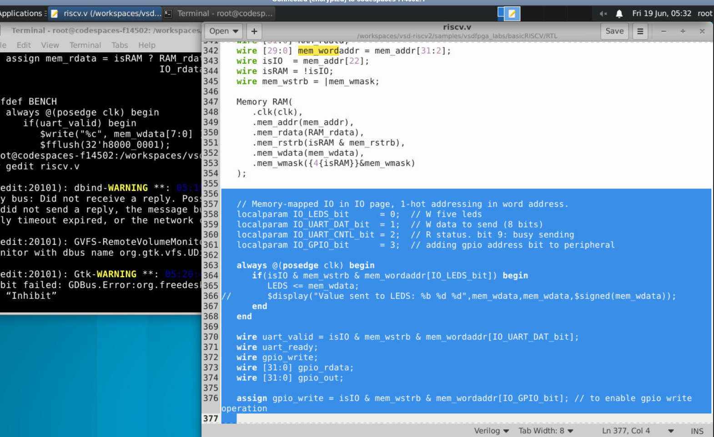

### IP instantiation and read multiplexer

```verilog
gpio_ip GPIO (
        .clk(clk),
        .rst(reset),
        .write_en(gpio_write),
        .w_data(mem_wdata),
        .r_data(gpio_rdata),
        .gpio_out(gpio_out));

corescore_emitter_uart #(
    .clk_freq_hz(12*1000000),
    .baud_rate(9600)
) UART(
    .i_clk(clk),
    .i_rst(!resetn),
    .i_data(mem_wdata[7:0]),
    .i_valid(uart_valid),
    .o_ready(uart_ready),
    .o_uart_tx(TXD)
);

// updating address according to CPU like if it want to read gpio or uart based address
wire [31:0] IO_rdata =
        mem_wordaddr[IO_GPIO_bit] ? gpio_rdata
        : mem_wordaddr[IO_UART_CNTL_bit]? {22'b0, !uart_ready,9'b0} : 32'b0;
```

The `gpio_ip` is instanced as `GPIO` and its `.write_en(gpio_write)` and `.w_data(mem_wdata)` are connected to the bus signals which are already defined in the SoC without any need for an additional bus protocol. The **read multiplexer** ("IO_rdata") is a chain of priorities where the first thing it checks is the `mem_wordaddr[IO_GPIO_bit]` and if true, returns the `gpio_rdata` back to the CPU, otherwise it proceeds to the next priority which is the UART control bit.

> `GPIO_IP_SOC__Instantiation.png` — `riscv.v` showing the `gpio_ip GPIO(...)` instantiation, the existing UART instantiation, and the `IO_rdata` read multiplexer that now includes the GPIO branch


### SoC top-level module (overall context)

```verilog
module SOC (
    input        RESET,  // reset button
    output reg [4:0] LEDS, // system LEDs
    input        RXD,    // UART receive
    output       TXD     // UART transmit
);
    ...
    Processor CPU(
       .clk(clk),
       .resetn(resetn),
       .mem_addr(mem_addr),
       .mem_rdata(mem_rdata),
       .mem_rstrb(mem_rstrb),
       .mem_wdata(mem_wdata),
       .mem_wmask(mem_wmask)
    );
```

The above proves that the GPIO IP resides within the same “SOC” block as that of the “Processor CPU” and “Memory RAM”, and hence, it makes use of the same “mem_addr” / “mem_wdata” / “mem_wmask” bus like all the other peripherals – just as the task specification demanded.

> `SOC_topmodule.png` — `riscv.v` showing the `module SOC(...)` declaration and `Processor CPU` instantiation with the shared bus wires


---

## Firmware & Simulation Validation

### Test firmware (`test_gpio.c`)

**First test (value 0x55):**
```c
#include "io.h"
#include "LIBFEMTOC/femtostdlib.h"

int main(){
        IO_OUT(IO_GPIO, 0x55);

        uint32_t data = IO_IN(IO_GPIO);

        printf("GPIO VALUE = 0x%x\n", data);

        if(data==0x55){
                printf("PASS\n");
        }
        else{
                printf("FAIL\n");
        }

        while(1);
        return 0;
}
```

**Second test (parameterized, value 0xA0):**
```c
#include "io.h"
#include "LIBFEMTOC/femtostdlib.h"

#define w_data 0xA0
int main(){
        IO_OUT(IO_GPIO, w_data);

        uint32_t data = IO_IN(IO_GPIO);

        printf("GPIO VALUE = 0x%x\n", data);

        if(data==w_data){
                printf("PASS\n");
        }
        else{
                printf("FAIL\n");
        }

        while(1);
        return 0;
}
```

**Code explanation:** The `IO_OUT(IO_GPIO, value)` will write the `value` into the GPIO register via the memory mapped macro. The `IO_IN(IO_GPIO)` will immediately read it out. The `if(data==w_data)` block is a **self-checking testbench technique** where the firmware itself asserts whether it is a PASS or a FAIL based on what it writes and then reads from the registers. `while(1)` freezes the CPU once the test is done.

> `GPIO_test_code.png` — `test_gpio.c` standalone view, parameterized test with `w_data = 0xA0`

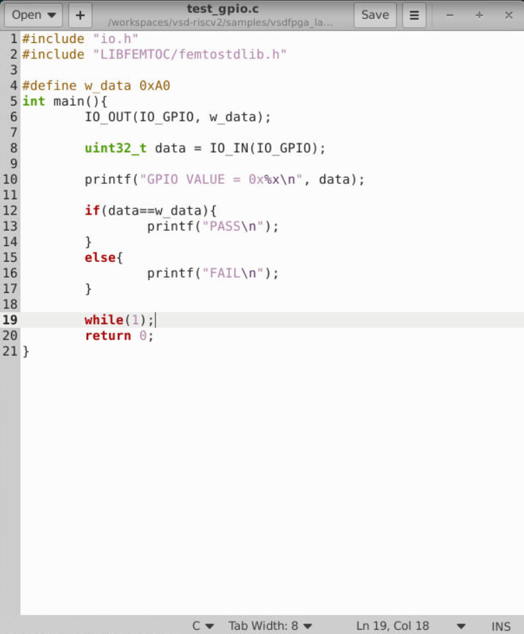

### Build flow (Makefile rule)

A new Makefile target `test_gpio_update` was added to automate building and deploying the test firmware:

```makefile
test_gpio_update:
	make test_gpio.bram.elf
	./firmware_words test_gpio.bram.elf -ram 6144 -max_addr 6144 -out test_gpio.hex
	cp test_gpio.hex ../RTL/firmware.hex
```

| Line            | Explanation                                                   |
|----------------|---------------------------------------------------------------|
| `make test_gpio.bram.elf` | Creates an executable file out of the `test_gpio.c` (and all dependencies like `start.S`, `print.c`, `memcpy.c` etc.) files in the form of bare-metal ELF file using the already present `%.bram.elf` target |
| `./firmware_words ... -ram 6144 -max_addr 6144 -out test_gpio.hex` | Converts this ELF file to a `.hex` file suitable for initializing the 6144-word BRAM memory |
| `cp test_gpio.hex ../RTL/firmware.hex` | Copies this hex file into the RTL directory for further use in the next simulation

> `Firware_build_cmd.png` — Makefile showing the new `test_gpio_update` target appended 


### Running the build

```bash
cd /workspaces/vsd-riscv2/samples/vsdfpga_labs/basicRISCV/Firmware
make test_gpio_update
```

**Output (truncated):**
```
riscv64-unknown-elf-gcc -I ./LIBFEMTOGL -I ./LIBFEMTORV32 -I ./LIBFEMTOC -fno-pic -march=rv32i -mabi=ilp32 -fno-stack-protector -w -Wl,--no-relax -c test_gpio.c
...
riscv64-unknown-elf-ld -T bram.ld -m elf32lriscv -nostdlib test_gpio.o putchar.o wait.o print.o memcpy.o errno.o perf.o ./libgcc.a -o test_gpio.bram.elf
./firmware_words test_gpio.bram.elf -ram 6144 -max_addr 6144 -out test_gpio.hex
   RAM_SIZE=6144
   LOAD ELF: test_gpio.bram.elf
        max address=2593
Code size: 648 words ( total RAM size: 1536 words )
Occupancy: 42%
testing MAX_ADDR limit: 6144
   max_addr OK
   SAVE HEX: test_gpio.hex
```

This confirms `test_gpio.c` cross-compiled correctly for `rv32i`/`ilp32` and fit comfortably within the BRAM budget (42% occupancy).

> `GPIO_Firmware_sim.png` — Full terminal log of `make test_gpio_update`: compile, assemble, link, and hex conversion steps

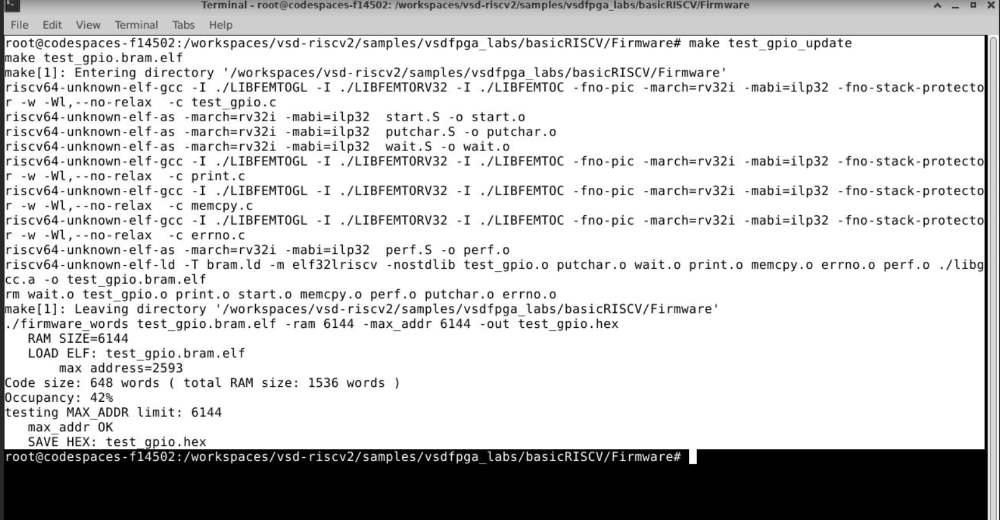

### RTL simulation (Icarus Verilog)

```bash
cd /workspaces/vsd-riscv2/samples/vsdfpga_labs/basicRISCV/RTL
iverilog -DBENCH -o simv riscv.v
vvp simv
```

| Command | Description |
|---|---|
| `iverilog -DBENCH -o simv riscv.v` | This command compiles the file `riscv.v` (which contains the new instance `gpio_ip`) into the simulation executable `simv`. The `-DBENCH` option is used to include the testbench block ("`ifdef BENCH`") which captures UART output and prints characters on the screen |
| `vvp simv` | Run the compiled simulation |

**Result 1 — `w_data = 0x55`:**
```
GPIO VALUE = 0x00000055
PASS
```

> `GPIO_simout_55.png` — `test_gpio.c` with `0x55` alongside the simulation terminal output `GPIO VALUE = 0x00000055` / `PASS`

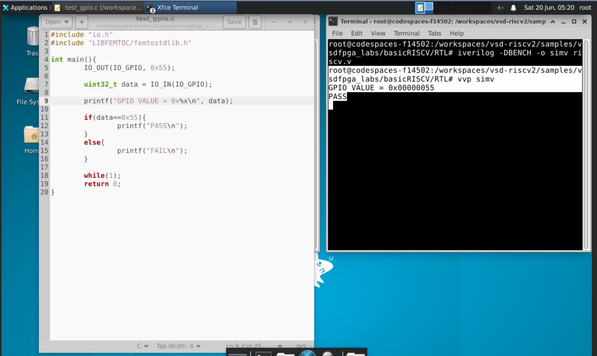

**Result 2 — `w_data = 0xA0`:**
```
GPIO VALUE = 0x000000A0
PASS
```

> `GPIO_simout_A0.png` — `test_gpio.c` with parameterized `w_data = 0xA0` and simulation output `GPIO VALUE = 0x000000A0` / `PASS`

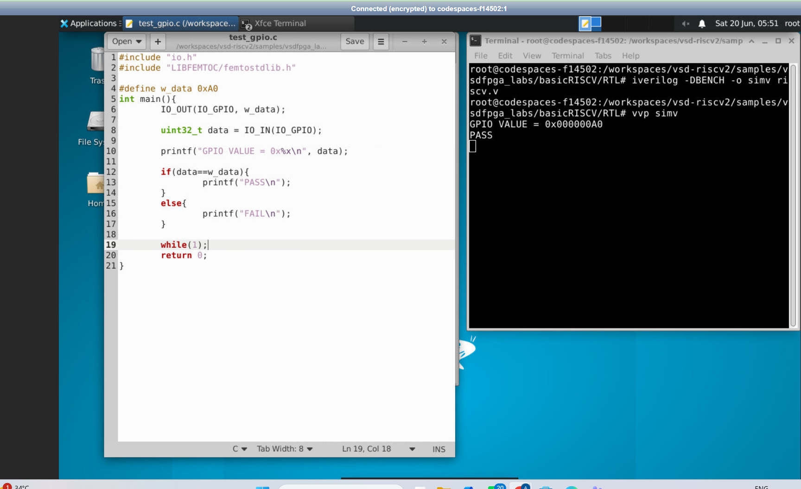

Both the simulations demonstrate **proper operation of the registers and proper reading of their contents** — exactly the same value that is written into IO_OUT is the one returned by IO_IN, twice, which proves the proper functionality of the write path, storage register, and read path.

---


### Synthesis (Yosys) + Place & Route (nextpnr)

```
Info: constrained 'LEDS[0]' to bel 'X4/Y31/io0'
Info: constrained 'LEDS[1]' to bel 'X6/Y31/io0'
...
Info: Packing LUT-FFs..
Info:      1019 LCs used as LUT4 only
Info:        71 LCs used as LUT4 and DFF
Info: Packing non-LUT FFs..
Info:        80 LCs used as DFF only
Info: Packing carries..
Info:        16 LCs used as CARRY only
Info: Constraining chains...
Info:        2 LCs used to legalise carry chains.
Info: Checksum: 0x5b774038
```

The GPIO IP added negligible resource overhead — the design still fits the iCE40UP5K's logic cells with room to spare (1019 LUT4-only + 71 LUT4/DFF + 80 DFF-only + 16 CARRY).

> `Yosys_synthesis.png` — Yosys synthesis + nextpnr packing report after adding the GPIO IP
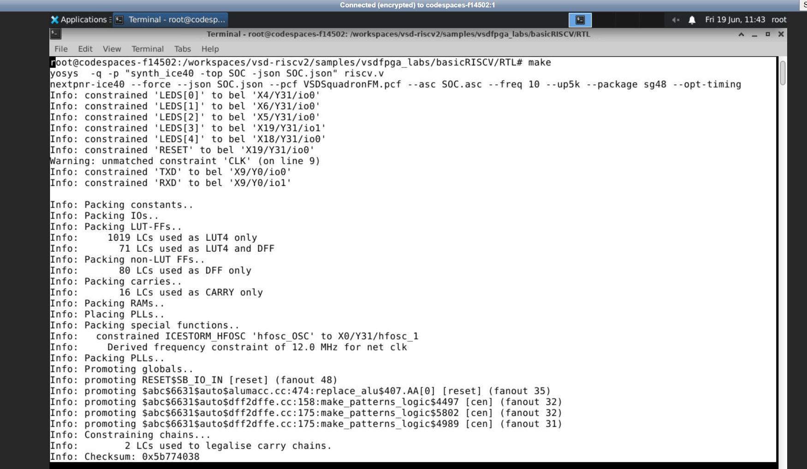

### Routing

```
Info: Routing..
Info: Routing 4643 arcs.
...
Info: Routing complete.
Info: Router1 time 5.89s
Info: Checksum: 0x5449d591
```

> `Routing.png` — nextpnr routing progress log: 4643 arcs routed in 5.89 seconds, no unrouted nets

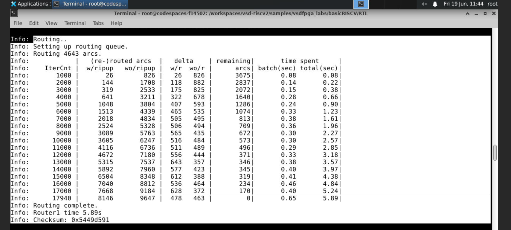

### Static Timing Analysis (STA)

```
Info: Max frequency for clock 'clk': 17.67 MHz (PASS at 12.00 MHz)
Info: Max delay <async>        -> posedge clk: 17.24 ns
Info: Max delay posedge clk -> <async>     : 14.12 ns
```

The design **passes timing** with margin — the maximum achievable clock frequency (17.67 MHz) comfortably exceeds the 12 MHz operating requirement.

> `STA_Res.png` — nextpnr static timing analysis: max frequency 17.67 MHz, PASS at the required 12.00 MHz

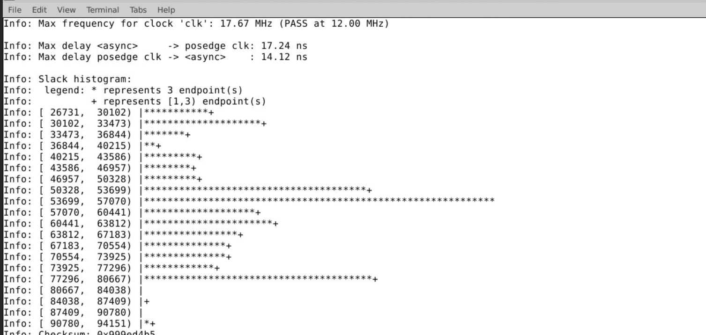

### Final bitstream timing estimate (icetime)

```
1 warning, 0 errors
Info: Program finished normally.
icetime -p VSDSquadronFM.pcf -P sg48 -r SOC.timings -d up5k -t SOC.asc
// Timing estimate: 63.25 ns (15.81 MHz)
icepack -s SOC.asc SOC.bin
```

> `timing_sim.png` — Final `icetime` timing estimate (15.81 MHz) and `icepack` generating the final `SOC.bin` bitstream, ready to flash

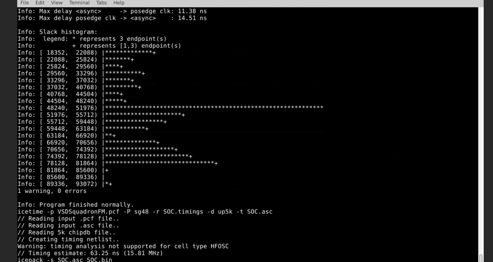

This proves that the GPIO-enabled SoC is **completely synthesizable, routable, and timing clean**, and therefore suitable for hardware programming, although the actual hardware flashing process was not carried out during this optional step.

---

## Complete Write & Read Data Flow

The diagram above traces both transactions end-to-end through the same hardware path.

### GPIO Write Transaction Procedure

1. **Software executes:** `IO_OUT(IO_GPIO, w_data)`
2. **CPU generates:** `mem_addr` = GPIO address, `mem_wdata` = w_data, `mem_wmask != 0`
3. **Address decoder tests:** `mem_wordaddr[IO_GPIO_bit]`
4. **GPIO write enable signal generated:** `gpio_write = isIO & mem_wstrb & mem_wordaddr[IO_GPIO_bit]`
5. **GPIO peripheral gets:** `write_en = gpio_write`, `w_data = mem_wdata`
6. **GPIO register updated:** `gpio_reg <= mem_wdata` (syncronous, on `posedge clk`)
7. **GPIO output shows** the value in the register through `gpio_out`

### GPIO Read Transaction Procedure

1. **Software executes:** `data = IO_IN(IO_GPIO)`
2. **CPU makes a read request:** `mem_addr` = GPIO address
3. **Address decoder selects GPIO module:** `mem_wordaddr[IO_GPIO_bit] = 1`
4. **GPIO peripheral provides:** `gpio_rdata = gpio_reg`
5. **IO read multiplexer selects GPIO:** `IO_rdata = gpio_rdata`
6. **SoC returns:** `mem_rdata = IO_rdata
7. **CPU receives** data from `mem_rdata`
8. **Software stores:** `data = mem_rdata`
9. **Verification:** `if(data == w_data) PASS else FAIL`

This two-phase flow is exactly what `test_gpio.c` exercises and what the simulation logs (`GPIO VALUE = 0x...` / `PASS`) confirm happened correctly.

---

## Signal Glossary

| Signal              | Description |
| ---                 | ---         |
| `mem_addr`          | 32-bit byte address from CPU for any memory/IO access |
| `mem_wordaddr`      | `mem_addr[31:2]` — address converted to word address (byte offset bits stripped) |
| `mem_wdata`         | 32-bit data bus from CPU in case of write to memory or peripheral |
| `mem_wmask`         | 4-bit byte write mask; `mem_wstrb = |mem_wmask` converts to "write cycle" strobe |
| `gpio_write`        | Write-enable signal for GPIO IP only — active when address, write strobe and GPIO bit match up |
| `gpio_reg`          | The actual 32-bit register in `gpio_ip.v` where the latest written value resides |
| `gpio_rdata`        | Value read from `gpio_ip.v` (equals `gpio_reg` always) |
| `IO_rdata`          | Output of SoC read multiplexer: selects the right peripheral read data (GPIO, UART control, etc.) to be sent back to CPU |
| `mem_rdata`         | Final data bus value returned to CPU on read cycle: either RAM data or `IO_rdata`, depending on `isRAM`/`isIO` |
---

## Screenshots Index

| Image File | Description |
|-----------|-------------|
| `GPIO_address_def.png` | `io.h` with new `IO_GPIO` offset added to the address map |
| `UART_RTL_directory.png` | RTL directory listing showing `riscv.v` and existing `emitter_uart.v` |
| `Gpio_IP_code.png` | Complete `gpio_ip.v` RTL module source |
| `GPIO_IP_Write_logic.png` | `riscv.v` — new `IO_GPIO_bit` localparam and `gpio_write` decode logic |
| `GPIO_IP_SOC__Instantiation.png` | `riscv.v` — `gpio_ip GPIO(...)` instantiation and `IO_rdata` read mux |
| `SOC_topmodule.png` | `riscv.v` — `module SOC(...)` top-level and `Processor CPU` instantiation |
| `GPIO_test_code.png` | `test_gpio.c` firmware source (parameterized `0xA0` version) |
| `Firware_build_cmd.png` | Makefile — new `test_gpio_update` target |
| `GPIO_Firmware_sim.png` | Terminal log of `make test_gpio_update` build |
| `GPIO_simout_55.png` | Simulation result for `w_data = 0x55` → PASS |
| `GPIO_simout_A0.png` | Simulation result for `w_data = 0xA0` → PASS |
| `Yosys_synthesis.png` | Yosys synthesis + nextpnr packing/LC usage report |
| `Routing.png` | nextpnr routing log (4643 arcs, 5.89s) |
| `STA_Res.png` | Static timing analysis — 17.67 MHz max, PASS at 12 MHz |
| `timing_sim.png` | Final icetime estimate + icepack bitstream generation |

---

## Learnings

- **1-hot peripheral decoding** — the addition of a new peripheral simply entails selection of the next free bit (`IO_GPIO_bit = 3`) and re-use of the same exact `isIO & mem_wstrb & mem_wordaddr[bit]` scheme used already to drive the LEDs and UART, no modification required of the CPU or bus protocol.
- **Synchronous-only design** — `gpio_reg` is updated strictly within the `always @(posedge clk)` block. This is the fundamental tenet of digital safety design.
- **Read multiplexing** — more than one peripheral shares access to the single `mem_rdata` bus. It is the `IO_rdata` multiplexer which enables the CPU to select the appropriate peripheral data in light of the address issued.
- **Self-checking firmware** — `test_gpio.c` requires no dedicated testbench scoreboard. The write/read/compare process from inside the C code itself is enough to verify correctness in simulation.
- **Simulation before synthesis** — `iverilog`/`vvp` flagged and verified correct operation in mere seconds well ahead of the minutes-long `yosys`/`nextpnr` hardware compilation process.
- **An added IP entails virtually no overhead** — the GPIO module consumed very few LCs in a design which already consumed ~1000+ LCs, while timing margin (17.67 MHz vs 12 MHz) remained adequate.

---

## Conclusion

The Simple GPIO Output IP was developed from scratch as a Verilog module operating in a synchronous fashion, and was implemented within the RISC-V SoC by expanding on the same 1-hot based address decoding mechanism that was being used for LEDs and UART, which was then tested using `iverilog` and `vvp` with two distinct test inputs (`0x55` and `0xA0`), with both returning `PASS`. In addition to the above, the entire open source flow for FPGA implementation was also tested (`yosys` → `nextpnr` → `icetime` → `icepack`), showing that the design synthesizes successfully, routes without any issues, and meets timing at 17.67 MHz while requiring only 12 MHz.

---
