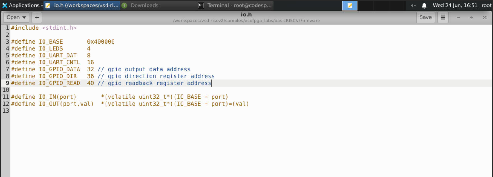
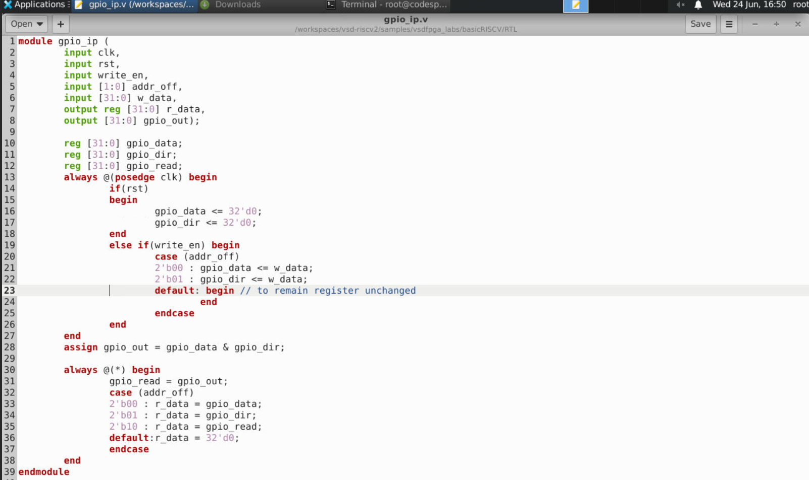
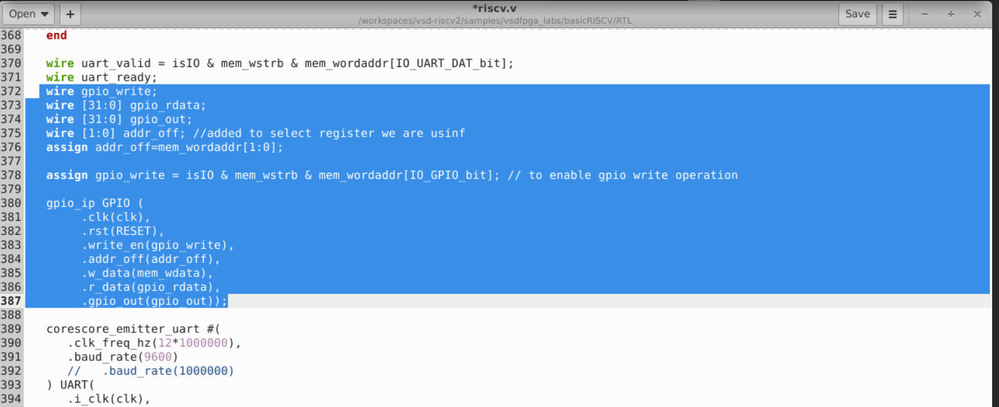
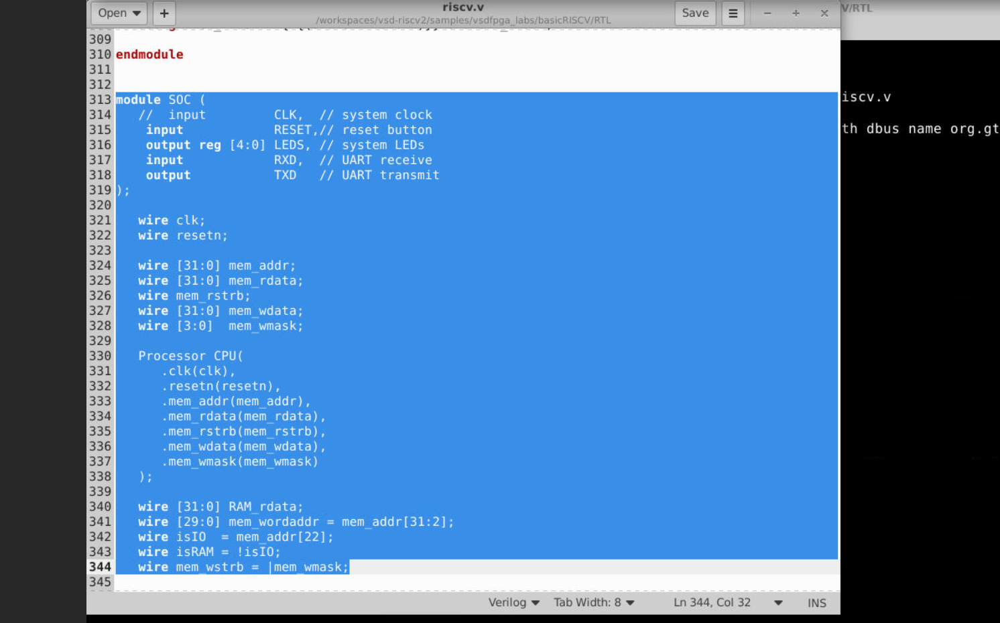
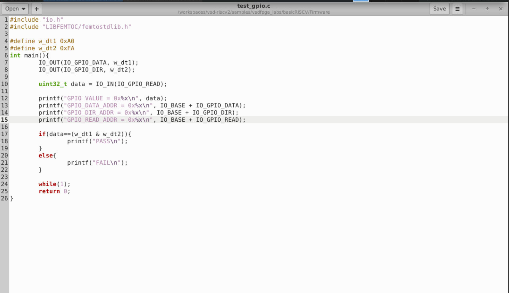
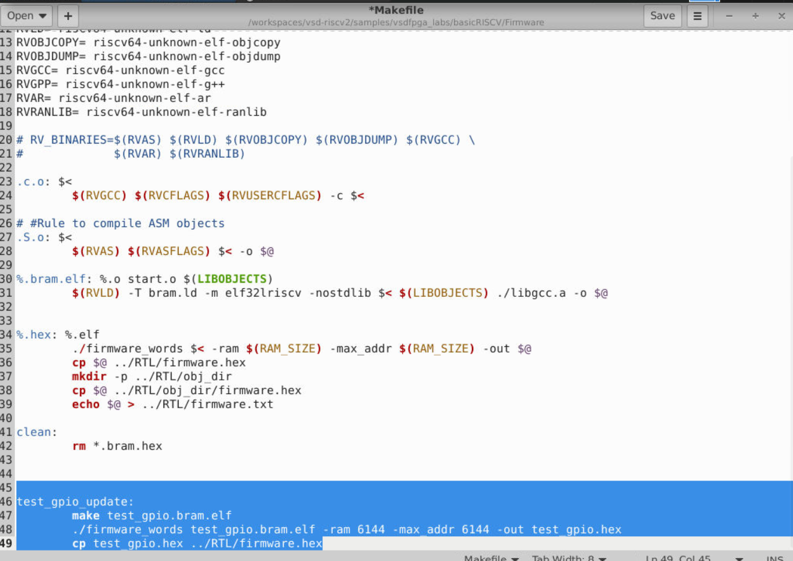
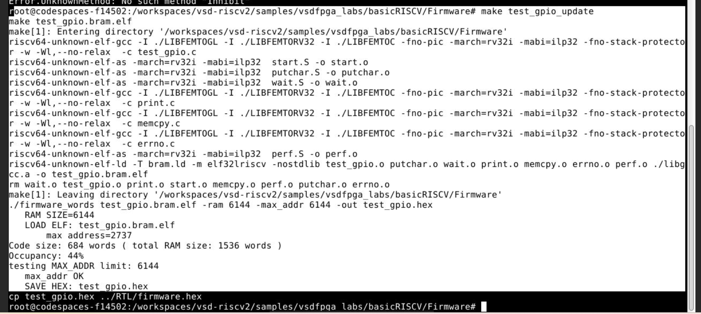
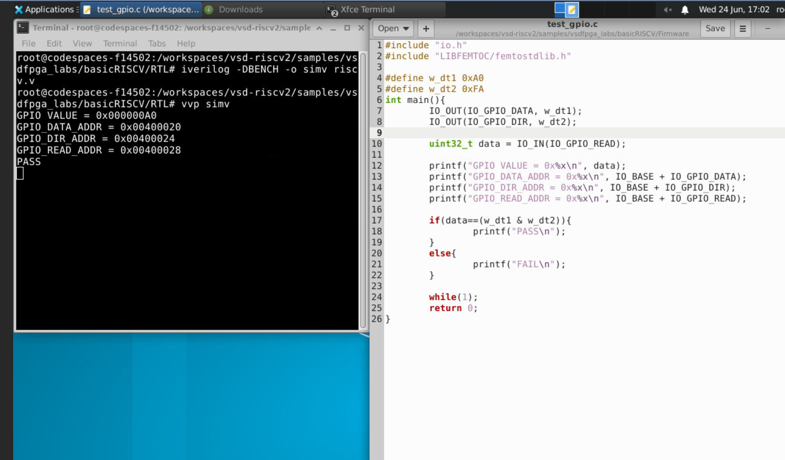
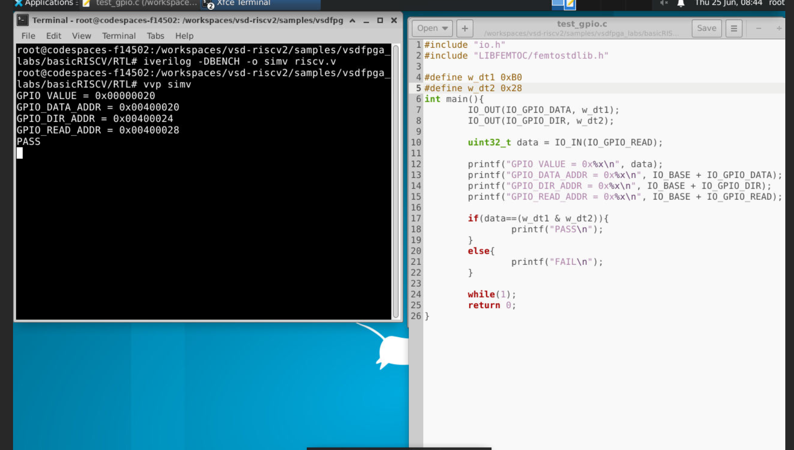
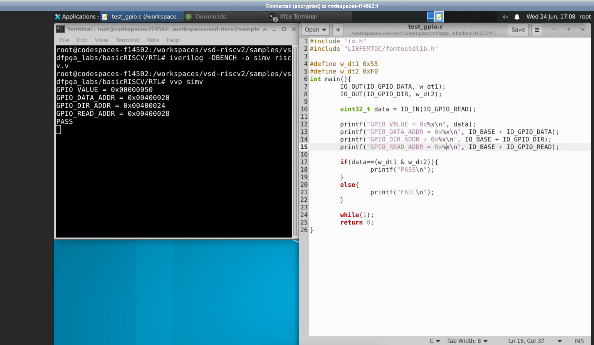

# Task-5: Design a Multi-Register GPIO IP with Software Control

This project enhances the existing single register GPIO IP of Task-2 by creating a practical, multiple register peripheral that includes direction, output data, and read back – precisely the type of GPIO peripheral seen in real SoCs.

---

## able of Contents

1. [Objective](#objective)
2. [What Changed from Previous Task](#what-changed-from-task-2)
3. [Register Map](#register-map)
4. [Planning & Address Offset Design](#planning--address-offset-design)
5. [Multi-Register GPIO IP RTL](#multi-register-gpio-ip-rtl)
6. [SoC Integration Updates](#soc-integration-updates)
7. [Firmware Validation](#firmware-validation)
8. [How Address Offsets Are Decoded](#how-address-offsets-are-decoded)
9. [How Direction Affects Behavior](#how-direction-affects-behavior)
10. [Screenshots Index](#screenshots-index)
11. [Learnings](#learnings)
12. [Conclusion](#conclusion)

---

## Objective

Extend the basic GPIO IP in Task-2 to a more practical multi-register software programmable IP. With the new IP, software can:
- Set the **direction of GPIO** pins (`GPIO_DIR`)
- Write data to the **GPIO Data Out** (`GPIO_DATA`)
- Read data from the **GPIO Pins** (`GPIO_READ`)

**Context:** GitHub Codespace `codespaces-f14502`, `vsd-riscv2/samples/vsdfpga_labs/basicRISCV`

---

## What Changed from Previous Task
| Feature      | Task-2 (one register)      | Task-3 (multiple registers)       |
|--------------|----------------------------|---------------------------------|
| Registers    | 1 (`gpio_reg`)             | 3 (`gpio_data`, `gpio_dir`, `gpio_read`) |
| Address offsets | No – one address            | `addr_off[1:0]` decides if it is DATA / DIR / READ |
| Direction setting | No – always an output          | `gpio_dir` decides which bits are active |
| Output       | `gpio_reg` directly         | `gpio_data & gpio_dir` (direction-wise) |
| Port addition in RTL code | -                | `input [1:0] addr_off` added |
| io.h additions    | `IO_GPIO = 32` only        | `IO_GPIO_DATA = 32`, `IO_GPIO_DIR = 36`, `IO_GPIO_READ = 40` |
| Change in SoC     | no connection to `addr_off`  | `addr_off = mem_wordaddr[1:0]` added |

---

## Register Map

| Register | Offset | Absolute Address | Description |
|----------|--------|-----------------|-------------|
| `GPIO_DATA` | 32 (0x20) | `0x400020` | Write: Sets outputs. Read: Returns last written value |
| `GPIO_DIR` | 36 (0x24) | `0x400024` | Write: Sets direction of each bit (1 = output, 0 = input). Read: Returns direction register |
| `GPIO_READ` | 40 (0x28) | `0x400028` | Read: Returns `gpio_data & gpio_dir` - current state |

**Base address:** `IO_BASE = 0x400000` (inherit from Task-2)

**Offsets to `addr_off[1:0]`:** The word address in the SoC is `mem_addr[31:2]`. The least significant 2 bits of the word address, `mem_wordaddr[1:0]`, are used as the subregister

```
Byte offset 32 = word address 8  → mem_wordaddr[1:0] = 2'b00 → GPIO_DATA
Byte offset 36 = word address 9  → mem_wordaddr[1:0] = 2'b01 → GPIO_DIR
Byte offset 40 = word address 10 → mem_wordaddr[1:0] = 2'b10 → GPIO_READ
```

---

## Planning & Address Offset Design

Design Decisions Before Writing RTL Based on the Review of the Task-2 GPIO IP

**Additions to be made:**
- Two extra registers: `gpio_dir` (direction) and `gpio_read` (read back)
- `addr_off`, 2-bits wide, will select the target register in the IP for write/read access
- `case(addr_off)` decoding for both write and read operations

**How to calculate `addr_off`:** We have that `mem_wordaddr = mem_addr[31:2]` in our existing SoC. Since this `mem_wordaddr` will naturally end up on 4-byte word boundary in our GPIO IP memory space, we can assign offsets 32, 36, 40 to correspond to word addresses 8, 9, 10, which have `mem_wordaddr[1:0]` equal to `00`, `01`, `10` respectively.

### Updated `io.h` — three GPIO offsets

```c
#include <stdint.h>

#define IO_BASE        0x400000
#define IO_LEDS        4
#define IO_UART_DAT    8
#define IO_UART_CNTL   16
#define IO_GPIO_DATA   32  // gpio output data address
#define IO_GPIO_DIR    36  // gpio direction register address
#define IO_GPIO_READ   40  // gpio readback register address

#define IO_IN(port)       *(volatile uint32_t*)(IO_BASE + port)
#define IO_OUT(port,val)  *(volatile uint32_t*)(IO_BASE + port)=(val)
```

Three new definitions have replaced the one definition of `IO_GPIO = 32` provided in Task-2. They correspond to three addresses, which are 4-byte aligned, and the difference between their offsets (equal to 4 bytes, i.e., 1 word) ensures that `mem_wordaddr[1:0]` increases in sequence: from `00` to `01` to `10`.

>`offset_assign_io.png` — `io.h` with all three offsets (32, 36, 40) for GPIO registers added to the address maps 


---

## Multi-Register GPIO IP RTL

### Complete `gpio_ip.v`

```verilog
module gpio_ip (
        input clk,
        input rst,
        input write_en,
        input [1:0] addr_off,
        input [31:0] w_data,
        output reg [31:0] r_data,
        output [31:0] gpio_out);

        reg [31:0] gpio_data;
        reg [31:0] gpio_dir;
        reg [31:0] gpio_read;

        always @(posedge clk) begin
                if(rst)
                begin
                        gpio_data <= 32'd0;
                        gpio_dir  <= 32'd0;
                end
                else if(write_en) begin
                        case (addr_off)
                        2'b00 : gpio_data <= w_data;
                        2'b01 : gpio_dir  <= w_data;
                        default: begin // to remain register unchanged
                                end
                        endcase
                end
        end

        assign gpio_out = gpio_data & gpio_dir;

        always @(*) begin
                gpio_read = gpio_out;
                case (addr_off)
                2'b00 : r_data = gpio_data;
                2'b01 : r_data = gpio_dir;
                2'b10 : r_data = gpio_read;
                default: r_data = 32'd0;
                endcase
        end
endmodule
```

### Detailed Code Explanation

#### Port interface changes from Previous Task

| Port                 | Change     | Reason                              |
|----------------------|------------|-------------------------------------|
| `input [1:0] addr_off`   | **New**    | Identifies the register (DATA/DIR/READ) that is accessed |
| `output reg [31:0] r_data`| Change to  `reg`        | Needs to come out of the combinational always@(*) block due to multiplexer logic|
| Three internal registers : `gpio_data`, `gpio_dir`, `gpio_read` | **New** | Each has its own individual register value |

#### Write logic — synchronous `always @(posedge clk)`

```verilog
always @(posedge clk) begin
    if(rst) begin
        gpio_data <= 32'd0;
        gpio_dir  <= 32'd0;
    end
    else if(write_en) begin
        case (addr_off)
        2'b00 : gpio_data <= w_data;    // addr_off 00 → write GPIO_DATA
        2'b01 : gpio_dir  <= w_data;    // addr_off 01 → write GPIO_DIR
        default: begin end               // addr_off 10 (READ) is not writable — hold value
        endcase
    end
end
```

Selection of register for storing incoming data is done using the `case(addr_off)` within the syncronous block. Selection of `default: begin end` case statement is an important choice made while implementing this module since this means that `GPIO_READ` (addr_off = `2'b10`) can’t be written to since writing to it does nothing to it – it remains read only since its value won’t change. The registers that are writable are `gpio_data` and `gpio_dir`. `gpio_read` doesn't have reset condition as it is a combinational logic.

#### GPIO output: direction masking

```verilog
assign gpio_out = gpio_data & gpio_dir;
```

This one statement alone is the core of the direction control circuit. The value of each `gpio_out` bit is the result of the AND operation between its respective `data` and `direction` bits:
- When `gpio_dir[N] = 1` (output): `gpio_out[N] = gpio_data[N]` — the data determines the pin
- When `gpio_dir[N] = 0` (input): `gpio_out[N] = 0` — the pin is unaffected by the data

This works just like actual GPIO: you need to configure the pin as an output (the direction register) before the data register affects it.

#### Read logic — combinational `always @(*)`

```verilog
always @(*) begin
    gpio_read = gpio_out;       // readback always tracks the actual output
    case (addr_off)
    2'b00 : r_data = gpio_data; // reading DATA register returns last written value
    2'b01 : r_data = gpio_dir;  // reading DIR register returns direction setting
    2'b10 : r_data = gpio_read; // reading READ register returns gpio_out (data & dir)
    default: r_data = 32'd0;
    endcase
end
```

This is a combinational module (`always @(*)`) and is asynchronous in nature; this means that it will react instantly to any changes in the address and/or data. The variable `gpio_read` is initially assigned `gpio_out` (which is the direction-masked output), after which `r_data` is multiplexed using `addr_off`. In essence, accessing the register `GPIO_READ` will yield the actual output, only those pins that have been set in `gpio_dir` will be nonzero.
>`gpio_ip_code.png` — Complete `gpio_ip.v` showing the 3-register architecture: synchronous write case, direction mask assign, and combinational read mux



---

## SoC Integration Updates

### New wires and `addr_off` decode in `riscv.v`

```verilog
wire uart_valid = isIO & mem_wstrb & mem_wordaddr[IO_UART_DAT_bit];
wire uart_ready;
wire gpio_write;
wire [31:0] gpio_rdata;
wire [31:0] gpio_out;
wire [1:0] addr_off; //added to select register we are using
assign addr_off = mem_wordaddr[1:0];

assign gpio_write = isIO & mem_wstrb & mem_wordaddr[IO_GPIO_bit]; // to enable gpio write operation

gpio_ip GPIO (
        .clk(clk),
        .rst(RESET),
        .write_en(gpio_write),
        .addr_off(addr_off),
        .w_data(mem_wdata),
        .r_data(gpio_rdata),
        .gpio_out(gpio_out));
```

**The critical new additions vs Previous Task:**

`wire [1:0] addr_off` and `assign addr_off = mem_wordaddr[1:0]`: This takes the bottom two bits of the word address and sends them as sub-register selectors to the GPIO IP. This is what enables a single gpio_write enable (IP select signal) to access three separate internal registers based on the address accessed by the CPU.

Why `mem_wordaddr[1:0]` and not `mem_addr[3:2]`? Both are equivalent because `mem_wordaddr = mem_addr[31:2]` and thus `mem_wordaddr[1:0] = mem_addr[3:2]`. Using `mem_wordaddr` is more clear because it has already been done.

`gpio_write` enable signal is identical to Task-2 and `IO_GPIO_bit = 3` continues to gate the entire GPIO IP region. Once the CPU address falls in the GPIO region, `addr_off` selects which of the three sub-registers is selected.

> `gpio_ip_soc_integration.png` — `riscv.v` showing the new `addr_off` wire + assign, the `gpio_write` enable, and the updated `gpio_ip GPIO(...)` instantiation with `.addr_off(addr_off)` connected



### SoC top-level module (unchanged from Task-2)

```verilog
module SOC (
    input        RESET,
    output reg [4:0] LEDS,
    input        RXD,
    output       TXD
);
    Processor CPU(
       .clk(clk),
       .resetn(resetn),
       .mem_addr(mem_addr),
       .mem_rdata(mem_rdata),
       .mem_rstrb(mem_rstrb),
       .mem_wdata(mem_wdata),
       .mem_wmask(mem_wmask)
    );
```

No modifications were necessary for the highest level `SOC` interface module and the CPU instantiations — the multi-register GPIO IP core is completely isolated inside the `riscv.v` decoder logic.

> `SOC_topmodule.png` – SoC top-level view with the unmodified `module SOC(...)` and `Processor CPU` instantiations – validating the CPU interface transparency with respect to the GPIO register expansion



> `UART_RTL_directory.png` — RTL directory listing showing all files: `riscv.v` (SoC), `gpio_ip.v` (new), `emitter_uart.v`, and synthesis output files


---

## Firmware Validation

### Test firmware (`test_gpio.c`)

The test program gives separate values to `GPIO_DATA` and `GPIO_DIR`, then reads back through `GPIO_READ` register, verifying the direction mask works correctly.

```c
#include "io.h"
#include "LIBFEMTOC/femtostdlib.h"

#define w_dt1 0xA0   // data to write to GPIO_DATA
#define w_dt2 0xFA   // direction mask to write to GPIO_DIR

int main(){
        IO_OUT(IO_GPIO_DATA, w_dt1);   // write 0xA0 to data register
        IO_OUT(IO_GPIO_DIR,  w_dt2);   // write 0xFA to direction register

        uint32_t data = IO_IN(IO_GPIO_READ); // read back effective output

        printf("GPIO VALUE = 0x%x\n", data);
        printf("GPIO_DATA_ADDR = 0x%x\n", IO_BASE + IO_GPIO_DATA);
        printf("GPIO_DIR_ADDR  = 0x%x\n", IO_BASE + IO_GPIO_DIR);
        printf("GPIO_READ_ADDR = 0x%x\n", IO_BASE + IO_GPIO_READ);

        if(data==(w_dt1 & w_dt2)){
                printf("PASS\n");
        }
        else{
                printf("FAIL\n");
        }

        while(1);
        return 0;
}
```

**Code explanation:**

- `IO_OUT(IO_GPIO_DATA, w_dt1)` → writes `0xA0` to the address location `0x400020` (DATA register, `addr_off = 2'b00`)
- `IO_OUT(IO_GPIO_DIR, w_dt2)` → writes `0xFA` to the address location `0x400024` (DIR register, `addr_off = 2'b01`)
- `IO_IN(IO_GPIO_READ)` → reads from the address location `0x400028` (READ register, `addr_off = 2'b10`) resulting in `gpio_out = gpio_data & gpio_dir`
- The PASS criteria is `data == (w_dt1 & w_dt2)` – the read back data should be equal to AND of the data and direction proving that the masking works
- The four `printf` statements print the GPIO value along with the actual address locations of all the three registers

> `gpio_test_program.png` – `test_gpio.c` standalone program view for testing with `w_dt1 = 0xA0`, `w_dt2 = 0xFA`



### Makefile — firmware build target

```makefile
test_gpio_update:
        make test_gpio.bram.elf
        ./firmware_words test_gpio.bram.elf -ram 6144 -max_addr 6144 -out test_gpio.hex
        cp test_gpio.hex ../RTL/firmware.hex
```

This is the same `test_gpio_update` Makefile target as Task-2. No modifications required because this same build process will automatically handle the updated firmware.

> `Firware_build_cmd.png` — Makefile illustrating the `test_gpio_update` target for building the test firmware



### Build log (`make test_gpio_update`)

```bash
make test_gpio_update
```
```
riscv64-unknown-elf-gcc ... -c test_gpio.c
riscv64-unknown-elf-as  ... start.S -o start.o
...
riscv64-unknown-elf-ld -T bram.ld -m elf32lriscv -nostdlib test_gpio.o ... -o test_gpio.bram.elf
./firmware_words test_gpio.bram.elf -ram 6144 -max_addr 6144 -out test_gpio.hex
   RAM_SIZE=6144
   LOAD ELF: test_gpio.bram.elf
        max address=2737
Code size: 684 words ( total RAM size: 1536 words )
Occupancy: 44%
   max_addr OK
   SAVE HEX: test_gpio.hex
cp test_gpio.hex ../RTL/firmware.hex
```

The firmware compiled and linked cleanly for `rv32i`/`ilp32`, occupying 44% of BRAM (684 words).

> `GPIO_Test_firmware.png` — Full terminal log of `make test_gpio_update` showing compile, assemble, link, hex conversion, and copy steps



### Simulation commands

```bash
cd /workspaces/vsd-riscv2/samples/vsdfpga_labs/basicRISCV/RTL
iverilog -DBENCH -o simv riscv.v
vvp simv
```

### Simulation results

**Test 1 — `w_dt1 = 0xA0`, `w_dt2 = 0xFA`** → expected readback: `0xA0 & 0xFA = 0xA0`

```
GPIO VALUE = 0x000000A0
GPIO_DATA_ADDR = 0x00400020
GPIO_DIR_ADDR  = 0x00400024
GPIO_READ_ADDR = 0x00400028
PASS
```

`0xA0 = 1010_0000` and `0xFA = 1111_1010` → AND = `1010_0000 = 0xA0`. Every bit of `0xA0` that is high also has a high direction bit in `0xFA`, hence all data goes through.

> `gpio_output_data.png` – Result of Test 1 simulation: `GPIO VALUE = 0xA0`, all three register address printed.



**Test 2 — `w_dt1 = 0xB0`, `w_dt2 = 0x28`** → expected readback: `0xB0 & 0x28 = 0x20`

```
GPIO VALUE = 0x00000020
GPIO_DATA_ADDR = 0x00400020
GPIO_DIR_ADDR  = 0x00400024
GPIO_READ_ADDR = 0x00400028
PASS
```

`0xB0 = 1011_0000` and `0x28 = 0010_1000` → AND = `0010_0000 = 0x20`. Only bit 5 is set in both data and direction, so only that bit appears in the readback — demonstrating that `gpio_dir` is correctly masking the output.

> `gpio_output_dir20.png` — Test 2 simulation result: `w_dt1 = 0xB0`, `w_dt2 = 0x28`, readback = `0x20`, `PASS`



**Test 3 — `w_dt1 = 0x55`, `w_dt2 = 0xF0`** → expected readback: `0x55 & 0xF0 = 0x50`

```
GPIO VALUE = 0x00000050
GPIO_DATA_ADDR = 0x00400020
GPIO_DIR_ADDR  = 0x00400024
GPIO_READ_ADDR = 0x00400028
PASS
```

`0x55 = 0101_0101` AND `0xF0 = 1111_0000` yields `0101_0000 = 0x50`. The lower nibble from data `0101` is filtered because the lower 4 bits are `0000`. Only the upper nibble gets through.

>`gpio_output_dir50.png` – Simulation test result for Test 3: `ww_dt1 = 0x55`, `w_dt2 = 0xF0`, readback = `0x50`, `PASS`


---

## How Address Offsets Are Decoded

*(Explanation)*

The GPIO IP core uses a 2-bit bus called `addr_off`, which is formed from the 2 least significant bits of the word address in the SoC (`mem_wordaddr[1:0] = mem_addr[3:2]`). Since the GPIO registers occupy consecutive word addresses inside the IO space, each register adds 1 to `mem_wordaddr[1:0]`:

```
IO_GPIO_DATA  at byte offset 32 → word address bits [1:0] = 2'b00 → selects gpio_data
IO_GPIO_DIR   at byte offset 36 → word address bits [1:0] = 2'b01 → selects gpio_dir
IO_GPIO_READ  at byte offset 40 → word address bits [1:0] = 2'b10 → selects gpio_read
```

In file `riscv.v`: the 2-bit selector signal `addr_off = mem_wordaddr[1:0]` is directly fed into the module `gpio_ip`. In `gpio_ip.v`, the two `case(addr_off)` statements inside the write and read blocks take care of selecting the correct register from which to put data in `w_data` and take it from `r_data` respectively. The single `gpio_write` enable (IO_GPIO_bit = 3 in the 1-hot decoder) enables the whole GPIO section, while `addr_off` subselects from it.

---

## How Direction Affects Behavior

*(explanation)*

The `gpio_dir` register implements per-bit output enable control via a simple AND mask:

```verilog
assign gpio_out = gpio_data & gpio_dir;
```

For each bit index N:
- **`gpio_dir[N] = 1` (output):** `gpio_out[N] = gpio_data[N]` – the data bit controls the GPIO
- **`gpio_dir[N] = 0` (input/disabled):** `gpio_out[N] = 0` – the GPIO is forced to zero irrespective of any value in `gpio_data`

The value returned from the `GPIO_READ` register is equivalent to the `gpio_out` value. Therefore, reading the `GPIO_READ` register will only give bits from the GPIO which have been set as outputs and data bit set. This is the conventional method of setting the direction of the GPIO pin where software should set the GPIO pin to an output mode first before manipulating the data. The results of the three simulations show that:
- `0xA0 & 0xFA = 0xA0` – bits pass through
- `0xB0 & 0x28 = 0x20` – reduced by mask
- `0x55 & 0xF0 = 0x50` – lower nibble zeroed by direction register

---

## Screenshots Index

| Image File | Description |
|-----------|-------------|
| `offset_assign_io.png` | Updated `io.h` with three GPIO offsets: `IO_GPIO_DATA=32`, `IO_GPIO_DIR=36`, `IO_GPIO_READ=40` |
| `gpio_ip_code.png` | Complete `gpio_ip.v` — multi-register RTL with 3 registers, write case statement, direction mask, and read mux |
| `gpio_ip_soc_integration.png` | `riscv.v` — new `addr_off` wire + assign and updated `gpio_ip GPIO(...)` instantiation |
| `SOC_topmodule.png` | SoC top-level `module SOC(...)` and CPU instantiation (unchanged) |
| `UART_RTL_directory.png` | RTL directory listing including `gpio_ip.v` and all SoC files |
| `gpio_test_program.png` | `test_gpio.c` — complete test firmware source |
| `Firware_build_cmd.png` | Makefile `test_gpio_update` target |
| `GPIO_Test_firmware.png` | Terminal: `make test_gpio_update` build log (684 words, 44% BRAM occupancy) |
| `gpio_output_data.png` | Simulation result 1: `w_dt1=0xA0`, `w_dt2=0xFA` → readback `0xA0`, PASS |
| `gpio_output_dir20.png` | Simulation result 2: `w_dt1=0xB0`, `w_dt2=0x28` → readback `0x20`, PASS |
| `gpio_output_dir50.png` | Simulation result 3: `w_dt1=0x55`, `w_dt2=0xF0` → readback `0x50`, PASS |

---

## Learnings

- **Multi-register IPs rely on intra-IP offset decode** – one peripheral IP may have several registers by selecting via `addr_off` within the module without adding additional top address bits for each register. This is how any actual peripheral (e.g., UART, timer, SPI) defines its register bank.
- **Synchronous write, combinational read** – write registers should be synchronous (write on clock edge avoids glitch), whereas read multiplexers should be combinational (instantaneous access without additional delay). Getting this wrong – either synchronous reads or combinational writes – results in hard-to-debug problems during simulation.
- **AND operation for direction masking** – GPIO output mask `gpio_out = gpio_data & gpio_dir` is the typical pattern for GPIO. In this case, direction and data registers are independent; interaction is done by hardware. No need to explicitly reset the data register for each pin used as an input.
- **Read-only registers using `default` write-case** — the way `GPIO_READ` became read-only was simple; all it takes is omission from the write case (keeping it inside the `default: begin end`) block. The read side is done separately, combinational style.
- **`addr_off = mem_wordaddr[1:0]` was the minimum change** — one extra wire and one assign in `riscv.v` did the trick in exposing the sub-reg selector to the IP. Everything else in the decode (`gpio_write`, read mux), nothing to change structurally except for adding `.addr_off(addr_off)` interface pin.
- **Firmware check `data == (w_dt1 & w_dt2)`** — by having the condition PASS if `data == (w_dt1 & w_dt2)`, it means the firmware actually tests the AND computed by hardware, not just verifies that the data was written correctly.
---

## Conclusion

The GPIO IP for previous task, single register-based design, was successfully upgraded into a fully-fledged 3 register GPIO Control IP, with a proper register map, direction masking, and readback facility. This was made possible by the introduction of a 2-bit `addr_off` input that was obtained by using `mem_wordaddr[1:0]`. This addition allows the IP to have three logically independent registers using one enable signal. The direction register (`GPIO_DIR`) determines the bits of data that will be transmitted via bitwise ANDing similar to actual SoC GPIO peripherals. 
There were three simulation runs with varying data and direction (`0xA0/0xFA → 0xA0`, `0xB0/0x28 → 0x20`, `0x55/0xF0 → 0x50`) combinations to validate proper register write, proper direction masking, and proper readback. All reported `PASS`. In the firmware, absolute addresses of all the three registers (`0x400020`, `0x400024`, `0x400028`) were successfully displayed, showing that the address mapping was successful.

---
