# Task-6: Design and Integrate an SPI Master IP (Minimal, Single-Byte, Mode 0)

In this project, a new memory-mapped **SPI Master** IP is introduced in the RISC-V SoC, along with the GPIO and UART peripherals that were previously defined, using the standard scheme of "one IP, one owner, one register window."

---

## Table of Contents

1. [Objective](#objective)
2. [What This IP Adds to the SoC](#what-this-ip-adds-to-the-soc)
3. [Register Map](#register-map)
4. [Planning & Address Offset Design](#planning--address-offset-design)
5. [SPI Master IP RTL](#spi-master-ip-rtl)
6. [SoC Integration Updates](#soc-integration-updates)
7. [Firmware Validation](#firmware-validation)
8. [How Address Offsets Are Decoded](#how-address-offsets-are-decoded)
9. [How a Transfer Actually Happens (Data Flow)](#how-a-transfer-actually-happens-data-flow)
10. [Screenshots Index](#screenshots-index)
11. [Learnings](#learnings)
12. [Conclusion](#conclusion)

---

## Objective

Create a **minimal SPI Master** module, Mode 0 (CPOL = 0, CPHA = 0), which can be driven by the RISC-V CPU from registers only. The added functionality allows the software to:
- Set the **SPI clock division factor** and **activate** the peripheral (`SPI_CTRL`)
- Send a **byte** (`SPI_TXDATA`)
- Initiate an 8-bit transfer and wait for its end (`SPI_STATUS`)
- Get a **received byte** (`SPI_RXDATA`)

**Context:** GitHub Codespace `codespaces-887761`, `vsd-riscv2/samples/vsdfpga_labs/basicRISCV`

---

## What This IP Adds to the SoC

| Feature | Before Task-6 (GPIO + UART only) | After Task-6 (+ SPI Master) |
|---------|-----------------------------------|------------------------------|
| Peripherals | GPIO (3 regs), UART | GPIO, UART, **SPI Master (4 regs)** |
| New signals | – | `sclk`, `mosi`, `miso`, `cs_n` |
| Address decode | `IO_GPIO_bit`, `IO_UART_CNTL_bit` | + `spi_sel` (top 2 bits of word address) |
| Registers | `gpio_data/dir/read`, UART ctrl | + `ctrl_reg`, `tx_reg`, `rx_reg`, `status_reg` |
| Sub-modules | `gpio_ip.v` (single file) | `spi_master.v` + `spi_clk_div.v` + `spi_shift.v` (3 files, one FSM) |
| io.h additions | `IO_GPIO_*` offsets | `IO_SPI_CTRL=48`, `IO_SPI_TXDATA=52`, `IO_SPI_RXDATA=56`, `IO_SPI_STATUS=60` |
| Change in SoC | – | New wires `spi_write`, `spi_rdata`, `spi_sel`; `IO_rdata` mux extended |

---

## Register Map

| Register | Offset | Absolute Address | Access | Description |
|----------|--------|-------------------|--------|--------------|
| `SPI_CTRL`   | 48 (0x30) | `0x400030` | R/W | Bit0: `EN` (enable block). Bit1: `START` (write 1 to trigger transfer, auto-clears). Bits[15:8]: `CLKDIV` (SCLK toggles every `CLKDIV+1` cycles) |
| `SPI_TXDATA` | 52 (0x34) | `0x400034` | R/W | Bits[7:0] — byte to transmit; loads the shift register |
| `SPI_RXDATA` | 56 (0x38) | `0x400038` | R   | Bits[7:0] — byte received from the last completed transfer |
| `SPI_STATUS` | 60 (0x3C) | `0x40003C` | R/W | Bit0: `BUSY` (1 while transfer in progress). Bit1: `DONE` (1 when finished; write‑1‑to‑clear) |

**Base address:** `IO_BASE = 0x400000` (shared with GPIO/UART).

**Offsets to `addr_off[1:0]`:** exactly the same word-address decoding scheme used for the GPIO IP in Task-5:

```
Byte offset 48 = word address 12 → mem_wordaddr[1:0] = 2'b00 → SPI_CTRL
Byte offset 52 = word address 13 → mem_wordaddr[1:0] = 2'b01 → SPI_TXDATA
Byte offset 56 = word address 14 → mem_wordaddr[1:0] = 2'b10 → SPI_RXDATA
Byte offset 60 = word address 15 → mem_wordaddr[1:0] = 2'b11 → SPI_STATUS
```

---

## Planning & Address Offset Design

Design decisions made before writing any RTL:

- The SPI block needs its **own decode window**, separate from GPIO/UART, so a new top-level select signal `spi_sel` is created instead of re-using `IO_GPIO_bit`/`IO_UART_CNTL_bit` style single-bit decode.
- Because SPI needs **4 registers** (`CTRL`, `TXDATA`, `RXDATA`, `STATUS`), the existing 2-bit `addr_off` bus (already used for GPIO) is reused — it simply gets a different meaning inside the SPI module.
- `spi_sel` is derived from the **upper two bits** of the word address (`mem_wordaddr[3] & mem_wordaddr[2]`) rather than a single bit, since SPI needs a 4-register (2-bit) sub-space, not a 1-bit one.
- `TXDATA`/`RXDATA` are only 8 bits wide functionally, but kept inside 32-bit registers (upper bits zero) to stay consistent with the "all registers are 32-bit, word-aligned" integration rule.

### Updated `io.h` — four new SPI offsets

```c
#include <stdint.h>

#define IO_BASE        0x400000
#define IO_LEDS        4
#define IO_UART_DAT    8
#define IO_UART_CNTL   16
#define IO_GPIO_DATA   32
#define IO_GPIO_DIR    36
#define IO_GPIO_READ   40
#define IO_SPI_CTRL    48
#define IO_SPI_TXDATA  52
#define IO_SPI_RXDATA  56
#define IO_SPI_STATUS  60

#define IO_IN(port)       *(volatile uint32_t*)(IO_BASE + port)
#define IO_OUT(port,val)  *(volatile uint32_t*)(IO_BASE + port)=(val)
```

Four new definitions were appended after the existing GPIO offsets. Each is 4 bytes apart (one word), so `mem_wordaddr[1:0]` walks `00 → 01 → 10 → 11` across `CTRL → TXDATA → RXDATA → STATUS`, exactly the pattern the SPI module's internal `case(addr_off)` expects.

> `spi_io_module.png` — `io.h` with the SPI register offsets (48, 52, 56, 60) added alongside the existing GPIO/UART map

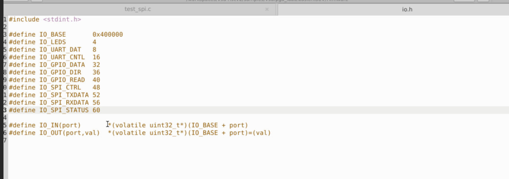

---

## SPI Master IP RTL

The IP is deliberately split into **three small modules** instead of one large block, so each concern — clocking, shifting, and control — can be verified independently:

```
spi_master.v      → top-level: registers, FSM, glue logic
   ├── spi_clk_div.v  → generates the divided SPI clock + a one-cycle "tick"
   └── spi_shift.v    → 8-bit shift register for TX and RX
```

### Complete `spi_master.v`

```verilog
module spi_master (
    input clk,
    input rst,
    input write_en,
    input [1:0] addr_off,
    input [31:0] w_data,
    output reg [31:0] r_data,
    output sclk,
    output mosi,
    input miso,
    output reg cs_n
);

    reg [31:0] ctrl_reg;
    reg [31:0] status_reg;
    reg [7:0]  tx_reg;
    reg [7:0]  rx_reg;
    reg [2:0]  bit_count;

    wire spi_clk;
    wire tick;
    reg  [1:0] state;

    localparam IDLE     = 2'd0;
    localparam LOAD     = 2'd1;
    localparam TRANSFER = 2'd2;
    localparam DONE     = 2'd3;

    assign sclk = spi_clk;

    spi_clk_div clk_inst (
        .clk(clk),
        .rst(rst),
        .enable(state == TRANSFER),
        .clk_div(ctrl_reg[15:8]),
        .spi_clk(spi_clk),
        .tick(tick)
    );

    wire [7:0] rx_data;
    reg  shift_en;
    reg  load, busy;

    spi_shift shift_inst (
        .clk(clk),
        .rst(rst),
        .load(load),
        .shift_en(shift_en),
        .tx_data(tx_reg),
        .miso(miso),
        .mosi(mosi),
        .rx_data(rx_data)
    );

    // ---- bit counter ----
    always @(posedge clk) begin
        if (rst)
            bit_count <= 3'd0;
        else if (state == LOAD)
            bit_count <= 3'd0;
        else if (state == TRANSFER && tick)
            bit_count <= bit_count + 1'b1;
    end

    // ---- FSM (sequential) ----
    always @(posedge clk) begin
        if (rst) begin
            state <= IDLE;
        end else begin
            case (state)
                IDLE: begin
                    if (ctrl_reg[0] && ctrl_reg[1])
                        state <= LOAD;
                end

                LOAD: begin
                    state <= TRANSFER;
                    $display("SPI START");
                    status_reg[0] <= 1'b1;   // BUSY
                    ctrl_reg[1]   <= 1'b0;   // auto-clear START
                end

                TRANSFER: begin
                    if (bit_count == 3'd7 && tick)
                        state <= DONE;
                end

                DONE: begin
                    $display("SPI DONE");
                    state <= IDLE;
                    status_reg[0] <= 1'b0;   // BUSY = 0
                    status_reg[1] <= 1'b1;   // DONE = 1
                    rx_reg <= rx_data;
                end

                default: state <= IDLE;
            endcase
        end
    end

    // ---- FSM (combinational outputs) ----
    always @(*) begin
        load     = 1'b0;
        shift_en = 1'b0;
        busy     = 1'b0;
        cs_n     = 1'b1;

        case (state)
            IDLE: begin
                busy = 1'b0;
                cs_n = 1'b1;
            end
            LOAD: begin
                load = 1'b1;
                busy = 1'b1;
                cs_n = 1'b0;
            end
            TRANSFER: begin
                busy = 1'b1;
                cs_n = 1'b0;
                if (tick)
                    shift_en = 1'b1;
            end
            DONE: begin
                busy = 1'b0;
                cs_n = 1'b1;
            end
        endcase
    end

    // ---- register writes ----
    always @(posedge clk) begin
        if (rst) begin
            ctrl_reg   <= 32'd0;
            status_reg <= 32'd0;
            tx_reg     <= 8'd0;
            rx_reg     <= 8'd0;
            bit_count  <= 3'd0;
        end
        else if (write_en) begin
            case (addr_off)
                2'b00: ctrl_reg <= w_data;
                2'b01: tx_reg   <= w_data[7:0];
                2'b11: if (w_data[1])
                           status_reg[1] <= 1'b0;   // write-1-to-clear DONE
            endcase
        end
    end

    // ---- register reads ----
    always @(*) begin
        case (addr_off)
            2'b00: r_data = ctrl_reg;
            2'b01: r_data = {24'd0, tx_reg};
            2'b10: r_data = {24'd0, rx_reg};
            2'b11: r_data = {30'b0, status_reg[1], status_reg[0]};
            default: r_data = 32'd0;
        endcase
    end
endmodule
```

> `spi_master_m1.png` – Port list, internal registers, and FSM localparams
> `spi_master_m2.png` – Sub-module instantiation (`spi_clk_div`, `spi_shift`) and bit counter
> `spi_master_m3.png` – Sequential FSM (`IDLE → LOAD → TRANSFER → DONE`)
> `spi_master_m4.png` – Combinational output logic (`busy`, `cs_n`, `load`, `shift_en`)
> `spi_master_m5.png` – Register write decode and read-back multiplexer

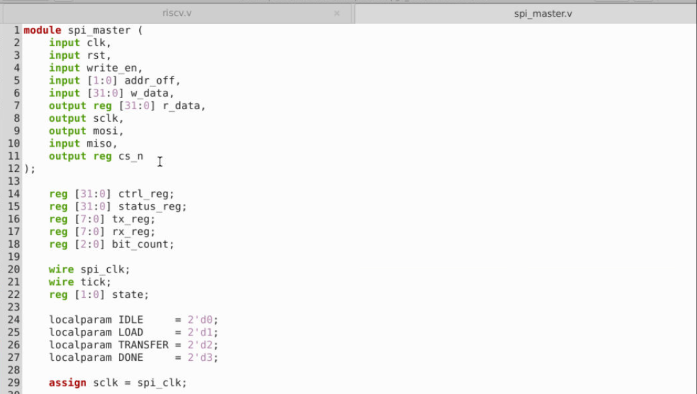
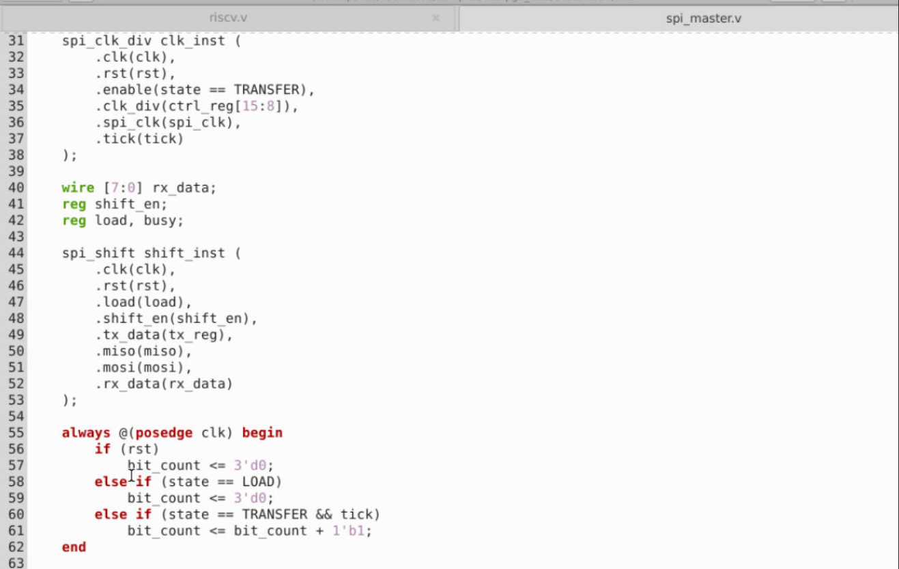
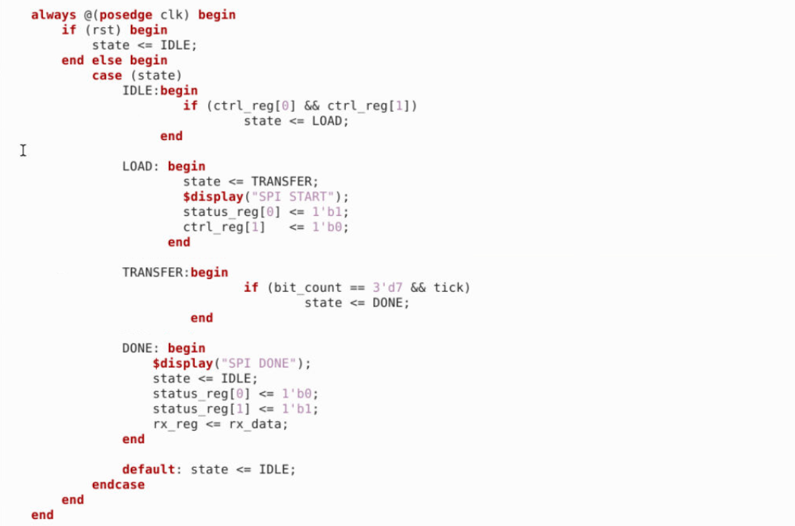
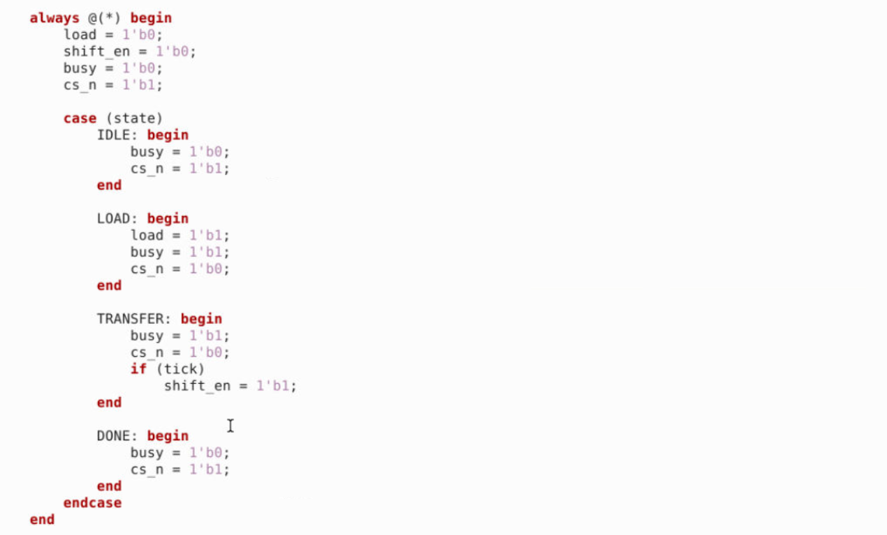
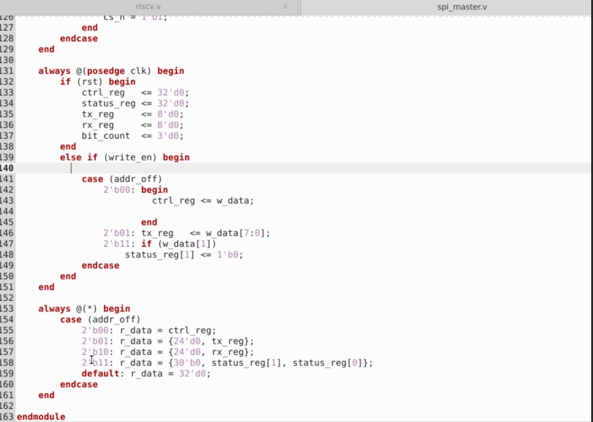

### Detailed Code Explanation

#### Port interface

| Port | Direction | Purpose |
|------|-----------|---------|
| `write_en`, `addr_off[1:0]`, `w_data[31:0]` | input | CPU bus write side — identical pattern to `gpio_ip` |
| `r_data[31:0]` | output reg | CPU bus read side — driven from a combinational mux |
| `sclk`, `mosi`, `cs_n` | output | The actual SPI wires going out to the pins |
| `miso` | input | Serial data coming back from the slave (or loopback) |

#### Internal registers and state

| Register | Width | Role |
|----------|-------|------|
| `ctrl_reg`   | 32 | Holds `EN`, `START`, `CLKDIV` |
| `status_reg` | 32 | Holds `BUSY` (bit0), `DONE` (bit1) |
| `tx_reg` / `rx_reg` | 8 | CPU-visible copies of the byte to send / last byte received |
| `bit_count`  | 3  | Counts 0…7 across one 8-bit transfer |
| `state`      | 2  | FSM state: `IDLE`, `LOAD`, `TRANSFER`, `DONE` |

#### Clock-divider & shift-register instantiation

`spi_clk_div` is enabled **only** while `state == TRANSFER`, and is programmed with `ctrl_reg[15:8]` (the `CLKDIV` field) — so the SPI serial clock only runs during an active transfer and its speed is fully software-controlled.

`spi_shift` is driven by two 1-bit control signals generated by the FSM: `load` (capture `tx_reg` at the start of a transfer) and `shift_en` (advance one bit, once per SCLK edge).

#### FSM states

| State | Trigger to enter | Action taken |
|-------|-------------------|--------------|
| `IDLE` | reset, or after `DONE` | Waits for `ctrl_reg[0]` (`EN`) **and** `ctrl_reg[1]` (`START`) to both be `1` |
| `LOAD` | `EN & START` seen in `IDLE` | Prints `SPI START`, sets `BUSY`, clears `START` (auto-clear), asserts `cs_n=0`, pulses `load=1` |
| `TRANSFER` | after `LOAD` | Shifts one bit per SCLK `tick`; counts with `bit_count`; stays until `bit_count==7 && tick` |
| `DONE` | 8th bit shifted | Prints `SPI DONE`, clears `BUSY`, sets `DONE`, latches `rx_data → rx_reg`, returns to `IDLE` |

#### Write logic — synchronous `always @(posedge clk)`

`addr_off` selects which register a CPU write targets: `2'b00 → ctrl_reg`, `2'b01 → tx_reg`, and `2'b11` implements **write‑1‑to‑clear** on `status_reg[1]` (`DONE`) — writing a 1 to that bit clears it, any other bit pattern is ignored. `RXDATA` (`2'b10`) is intentionally **absent** from the write case, making it read-only — the same `default: begin end` trick used for `GPIO_READ` in Task-5.

#### Read logic — combinational mux

A single `case(addr_off)` drives `r_data` instantaneously from whichever register is addressed; any offset outside `00/01/10/11` (there are none here, since `addr_off` is only 2 bits) would fall to `default: r_data = 32'd0`, keeping the "undefined offsets return 0" rule intact.

### `spi_clk_div.v` — programmable clock divider

```verilog
module spi_clk_div(
    input clk,
    input rst,
    input enable,
    input [7:0] clk_div,
    output reg spi_clk,
    output reg tick
);

    reg [7:0] counter;

    always @(posedge clk) begin
        if(rst) begin
            counter <= 8'd0;
            tick    <= 1'b0;
            spi_clk <= 1'b0;
        end
        else if(enable) begin
            if(counter == clk_div) begin
                counter <= 8'd0;
                spi_clk <= ~spi_clk;
                tick    <= 1'b1;
            end
            else begin
                counter <= counter + 1'b1;
                tick    <= 1'b0;
            end
        end
        else begin
            counter <= 8'd0;
            tick    <= 1'b0;
            spi_clk <= 1'b0;
        end
    end
endmodule
```

> `spi_clk_div_code.png` — Complete clock-divider RTL

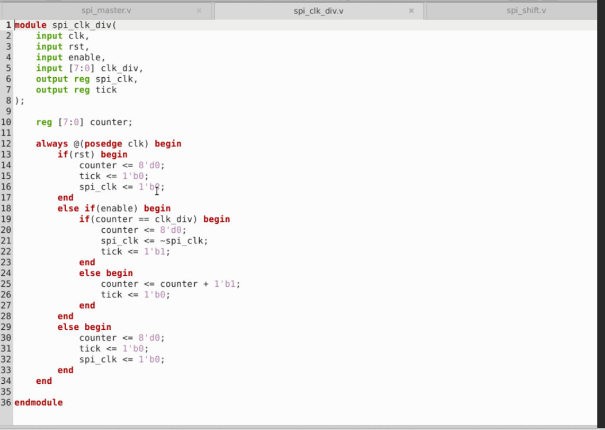

**How it works:** while `enable=1`, `counter` counts system-clock cycles. When it reaches `clk_div`, the counter resets to 0, `spi_clk` **toggles**, and `tick` pulses for exactly one cycle. So `spi_clk` flips every `(clk_div + 1)` system-clock cycles — matching the spec's `SCLK toggles every (CLKDIV+1) cycles`. When `enable=0`, both `counter` and `spi_clk` are forced to 0, so SCLK idles **low** between transfers, correct for Mode 0 (CPOL = 0).

### `spi_shift.v` — TX/RX shift register

```verilog
module spi_shift(
    input clk,
    input rst,
    input load,
    input shift_en,
    input [7:0] tx_data,
    input miso,
    output mosi,
    output [7:0] rx_data
);

    reg [7:0] shift_tx;
    reg [7:0] shift_rx;

    always @(posedge clk) begin
        if(rst) begin
            shift_tx <= 8'd0;
            shift_rx <= 8'd0;
        end
        else begin
            if(load) begin
                shift_tx <= tx_data;
                shift_rx <= 8'd0;
            end
            else if(shift_en) begin
                shift_tx <= {shift_tx[6:0],1'b0};
                shift_rx <= {shift_rx[6:0],miso};
            end
        end
    end

    assign mosi = shift_tx[7];
    assign rx_data = shift_rx;
endmodule
```

> `spi_shiftreg_code.png` — Complete shift-register RTL

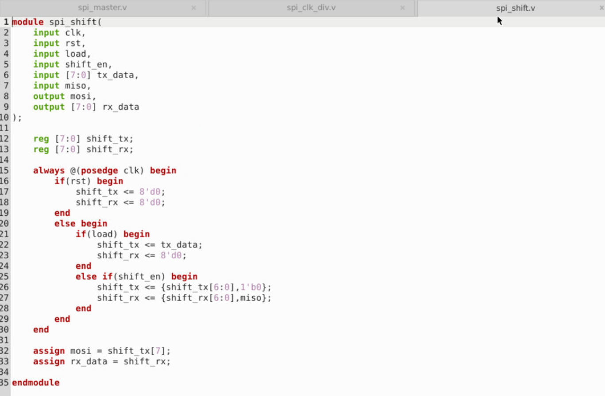

**How it works:** on `load`, `shift_tx` is loaded from `tx_data` (`shift_rx` cleared). On every `shift_en` pulse, `shift_tx` shifts **left** by one, pushing a `0` in at the bottom, while its **MSB (`shift_tx[7]`)** is continuously driven onto `mosi` — this gives MSB-first transmission. Simultaneously, `shift_rx` shifts left and captures the current `miso` bit into its LSB, so after 8 shifts `shift_rx` (→ `rx_data`) holds the complete received byte, MSB-first as well.

---

## SoC Integration Updates

### New wires and address decode in `riscv.v`

```verilog
wire spi_write;
wire [31:0] spi_rdata;
wire spi_sclk;
wire spi_mosi;
wire spi_cs_n;
wire [1:0] addr_off;
wire spi_sel; // to select bit from wordaddress

assign spi_sel   = isIO & mem_wordaddr[3] & mem_wordaddr[2];
assign addr_off  = mem_wordaddr[1:0];
assign gpio_write = isIO & mem_wstrb & mem_wordaddr[IO_GPIO_bit];
assign spi_write  = spi_sel & mem_wstrb;
```

> `spi_variable_riscv.png` — New SPI wires and `spi_sel`/`spi_write` address decode

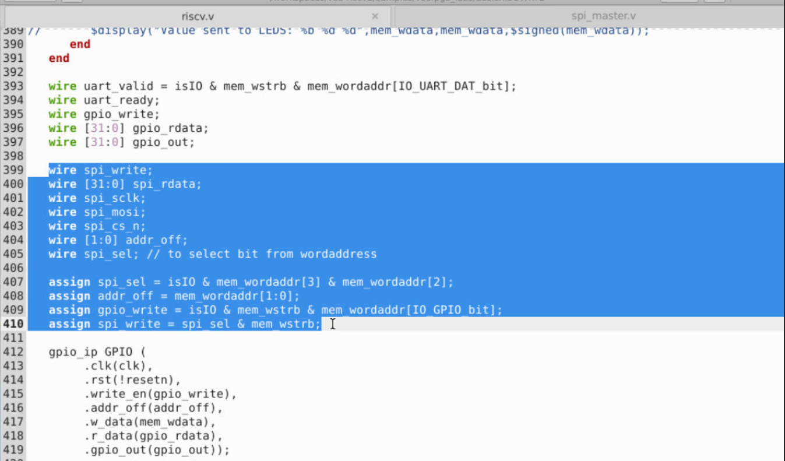

`spi_sel` is `1` only when the two most-significant bits of the word address (`mem_wordaddr[3]` and `mem_wordaddr[2]`) are both set — giving the SPI block its own 4-word (16-byte) decode region, separate from GPIO/UART. `addr_off` is the same 2-bit sub-selector already used for GPIO, reused here to pick between `CTRL/TXDATA/RXDATA/STATUS`.

### Module instantiation

```verilog
spi_master SPI(
    .clk(clk),
    .rst(!resetn),
    .write_en(spi_write),
    .addr_off(addr_off),
    .w_data(mem_wdata),
    .r_data(spi_rdata),
    .sclk(spi_sclk),
    .mosi(spi_mosi),
    .miso(spi_mosi),
    .cs_n(spi_cs_n));
```

> `spi_ip_inst_riscv.png` — `spi_master` instantiated alongside GPIO/UART

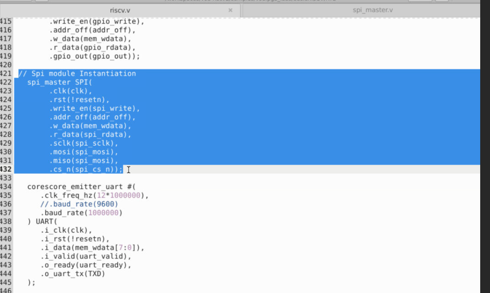

For bring-up in simulation, `.miso(spi_mosi)` ties MISO directly to MOSI — a **loopback** connection. Whatever the master transmits, it immediately receives back, which turns the whole test into a simple equality check (`RXDATA == TXDATA`) with no external SPI device required.

### CPU read-data mux

```verilog
wire [31:0] IO_rdata =
        spi_sel ? spi_rdata :
        mem_wordaddr[IO_GPIO_bit] ? gpio_rdata :
        mem_wordaddr[IO_UART_CNTL_bit] ? { 22'b0, !uart_ready, 9'b0}
                                        : 32'b0;

assign mem_rdata = isRAM ? RAM_rdata : IO_rdata ;
```

> `IO_read_riscv.png` — `IO_rdata` mux extended with the `spi_sel` case ahead of GPIO/UART

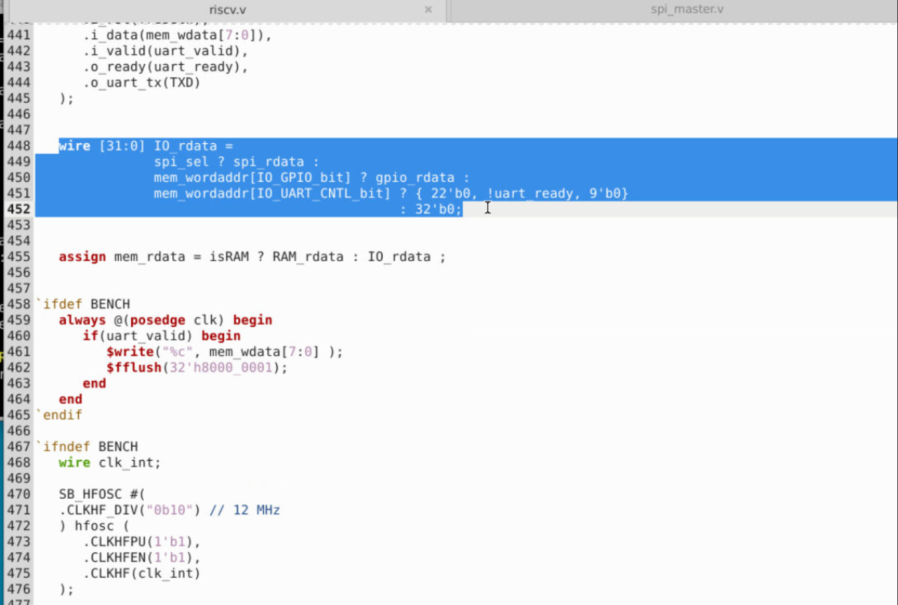

This is the **single point of visibility** for the SPI IP: any `lw` from the SPI address window is routed to `spi_rdata`; everything else falls through unchanged to the pre-existing GPIO/UART logic — the entire integration change is small and low-risk.

For reference, the overall SoC top-level port list all peripherals live inside, plus the benchtest clock/reset generation:

> `Soc_top_module.png` — `module SOC(CLK, RESET, LEDS, RXD, TXD)` and `ifdef BENCH` clock/reset

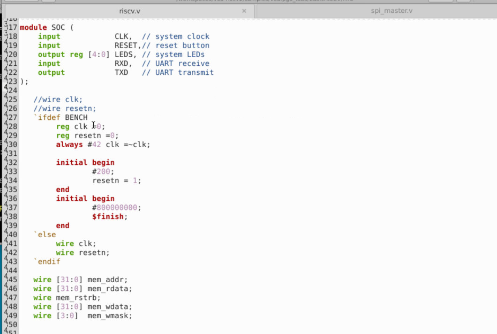

---

## Firmware Validation

### `test_spi.c` — complete test firmware

```c
#include "io.h"
#include "LIBFEMTOC/femtostdlib.h"

#define TX_VALUE   0xBE

int main()
{
    uint32_t ctrl;
    uint32_t status;
    uint32_t rx;

    printf("\n===== SPI MASTER TEST =====\n");
    // Configure SPI
    ctrl = (10 << 8) | (1 << 0);
    // CLKDIV = 10
    // EN = 1

    IO_OUT(IO_SPI_CTRL, ctrl);
    printf("SPI CTRL = 0x%x\n", ctrl);

    // Load transmit data
    IO_OUT(IO_SPI_TXDATA, TX_VALUE);
    printf("TX DATA = 0x%x\n", TX_VALUE);

    // Start Transfer
    ctrl |= (1 << 1);
    IO_OUT(IO_SPI_CTRL, ctrl);
    printf("Transfer Started...\n");

    do
    {
        status = IO_IN(IO_SPI_STATUS);
    } while ((status & 0x2) == 0);

    printf("STATUS = 0x%x\n", status);

    rx = IO_IN(IO_SPI_RXDATA);
    printf("RX DATA = 0x%x\n", rx);

    if ((rx & 0xFF) == TX_VALUE)
    {
        printf("PASS\n");
    }
    else
    {
        printf("FAIL\n");
    }

    IO_OUT(IO_SPI_STATUS, 0x2);   // clear DONE

    while (1);
    return 0;
}
```

> `spi_test_code1.png` — setup: CTRL config, TXDATA load, START trigger
> `spi_test_code2.png` — polling STATUS, RXDATA read, PASS/FAIL check, DONE clear

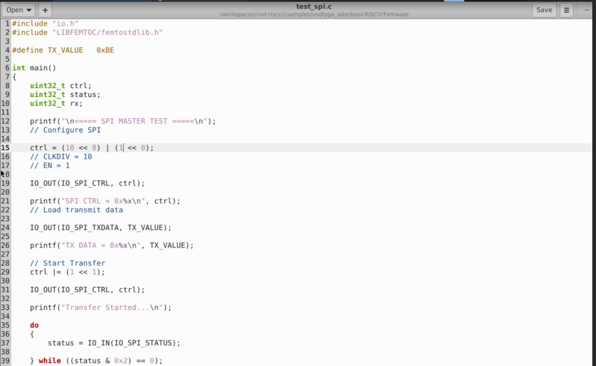
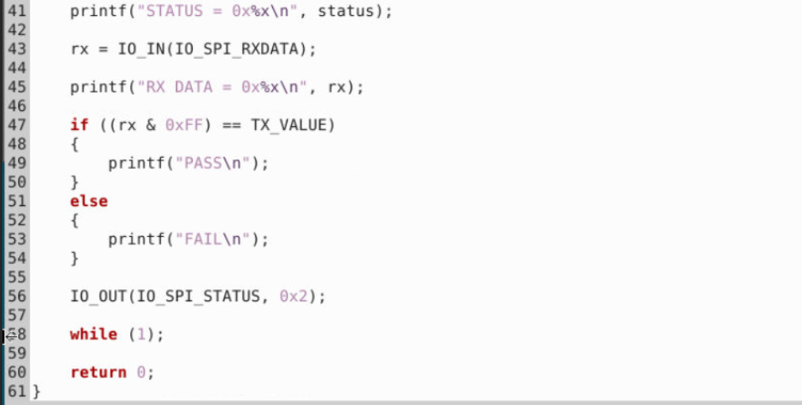

**Firmware sequence (matches the spec's validation checklist exactly):**
1. Program `CLKDIV=10` and `EN=1` into `SPI_CTRL`.
2. Write the byte to send into `SPI_TXDATA`.
3. Set `START` (bit1 of `SPI_CTRL`) to launch the transfer.
4. Poll `SPI_STATUS` bit1 (`DONE`) in a `do…while` loop.
5. Read `SPI_RXDATA` and compare to the value that was sent.
6. Clear `DONE` by writing `1` back to `SPI_STATUS` bit1.

### Build log (`make test_spi_update`)

```bash
make test_spi_update
```
```
riscv64-unknown-elf-gcc ... -c test_spi.c
riscv64-unknown-elf-as  ... start.S -o start.o
...
riscv64-unknown-elf-ld -T bram.ld -m elf32lriscv -nostdlib test_spi.o ... -o test_spi.bram.elf
./firmware_words test_spi.bram.elf -ram 6144 -max_addr 6144 -out test_spi.hex
   RAM_SIZE=6144
   LOAD ELF: test_spi.bram.elf
        max address=2849
Code size: 712 words ( total RAM size: 1536 words )
Occupancy: 46%
testing MAX_ADDR limit: 6144
   max_addr OK
   SAVE HEX: test_spi.hex
```

The firmware compiled and linked cleanly for `rv32i`/`ilp32`, occupying 46% of BRAM (712 words).

> `spi_hexgen.png` — Full terminal log of `make test_spi_update` (compile → assemble → link → hex conversion)

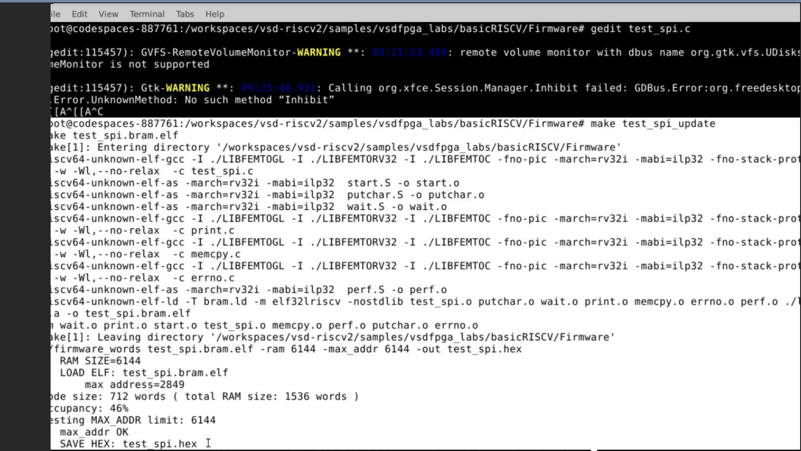

### Simulation commands

```bash
cd /workspaces/vsd-riscv2/samples/vsdfpga_labs/basicRISCV/RTL
iverilog -DBENCH -o simv riscv.v
vvp simv
```

### Simulation results

**Test 1 — `TX_VALUE = 0xA5`** → expected `RX DATA = 0xA5`

```
===== SPI MASTER TEST =====
SPI CTRL = 0x00000A01
TX DATA  = 0x000000A5
SPI START
SPI DONE
Transfer Started...
STATUS   = 0x00000002
RX DATA  = 0x000000A5
PASS
```

`0xA5 = 1010_0101` — went in on `mosi`, looped straight back on `miso`, and came out identical on `RXDATA`.

> `spi_res1.png` — Simulation result, Test 1: `TX_VALUE=0xA5` → `RX DATA=0xA5`, PASS

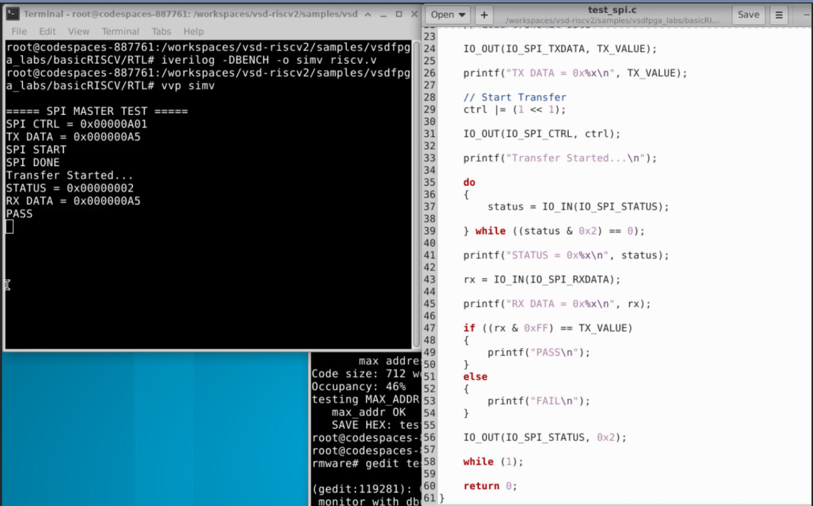

**Test 2 — `TX_VALUE = 0xFA`** → expected `RX DATA = 0xFA`

```
SPI CTRL = 0x00000A01
TX DATA  = 0x000000FA
SPI START
SPI DONE
Transfer Started...
STATUS   = 0x00000002
RX DATA  = 0x000000FA
PASS
```

`0xFA = 1111_1010` — a mixed run of 1s and 0s, good for catching MSB/LSB ordering bugs; result still matches exactly.

> `spi_res2.png` — Simulation result, Test 2: `TX_VALUE=0xFA` → `RX DATA=0xFA`, PASS

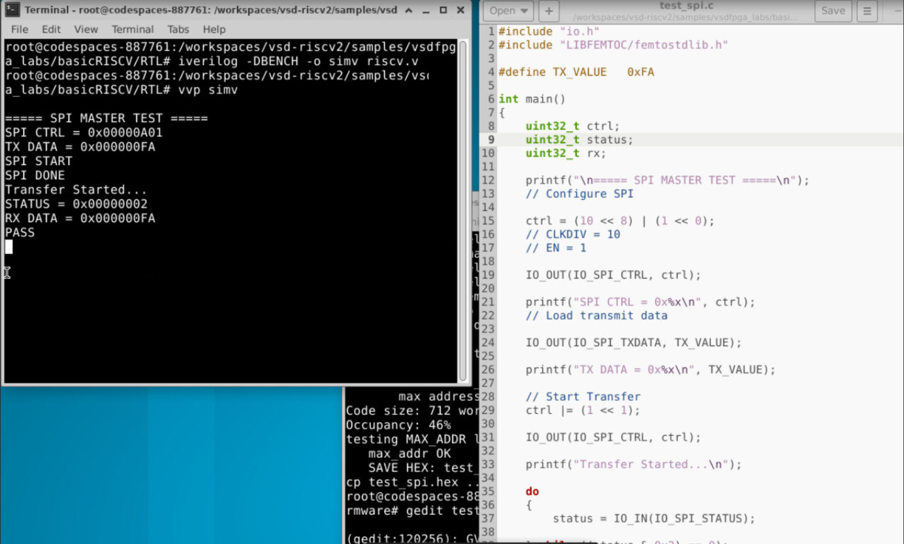

**Test 3 — `TX_VALUE = 0xBE`** → expected `RX DATA = 0xBE`

```
SPI CTRL = 0x00000A01
TX DATA  = 0x000000BE
SPI START
SPI DONE
Transfer Started...
STATUS   = 0x00000002
RX DATA  = 0x000000BE
PASS
```

`0xBE = 1011_1110` — another asymmetric pattern; transfer again completes correctly with `STATUS=0x2` (`DONE` set, `BUSY` clear).

> `spi_res3.png` — Simulation result, Test 3: `TX_VALUE=0xBE` → `RX DATA=0xBE`, PASS

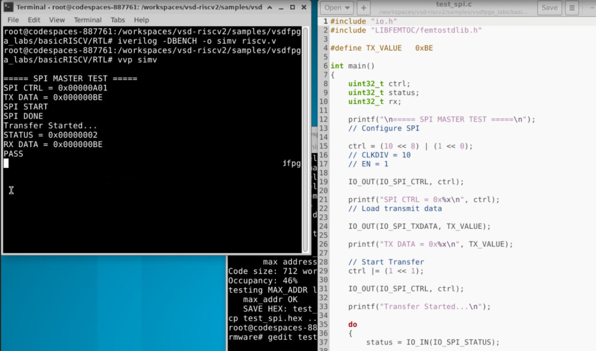

Across all three runs the log sequence is identical (`SPI CTRL → TX DATA → SPI START → SPI DONE → Transfer Started... → STATUS → RX DATA → PASS`), which is exactly what a correctly-designed peripheral should show: **deterministic, repeatable timing driven by the FSM and bit counter, independent of the actual data value being shifted.**

---

## How Address Offsets Are Decoded

The SPI IP core uses the same 2-bit `addr_off` bus already wired for GPIO (`mem_wordaddr[1:0]`), but is only *enabled* by a different top-level select signal, `spi_sel`, formed from the two bits **above** that (`mem_wordaddr[3] & mem_wordaddr[2]`):

```
SPI_CTRL   at byte offset 48 → mem_wordaddr[1:0] = 2'b00 → selects ctrl_reg
SPI_TXDATA at byte offset 52 → mem_wordaddr[1:0] = 2'b01 → selects tx_reg
SPI_RXDATA at byte offset 56 → mem_wordaddr[1:0] = 2'b10 → selects rx_reg (read-only)
SPI_STATUS at byte offset 60 → mem_wordaddr[1:0] = 2'b11 → selects status_reg (write-1-to-clear)
```

In `riscv.v`: `spi_sel` gates whether the SPI block's `write_en` is active at all (`spi_write = spi_sel & mem_wstrb`) and whether `IO_rdata` routes through `spi_rdata`. Inside `spi_master.v`, the `case(addr_off)` blocks for write and read then pick the exact register — precisely mirroring the two-level decode structure (outer IP-select, inner register-select) used for GPIO in Task-5, just with 4 registers instead of 3.

---

## How a Transfer Actually Happens (Data Flow)

This is the full story of one transfer, tying the RTL to the simulation log:

1. **Configure** — CPU writes `CLKDIV=10, EN=1` to `CTRL`. FSM stays in `IDLE` since `START` (bit1) is still 0.
2. **Load TX byte** — CPU writes the byte into `tx_reg` (does not move yet — it's just parked in a register).
3. **Start** — CPU sets `START`. On the next clock, FSM sees `EN & START` in `IDLE` and moves `IDLE → LOAD`. In `LOAD`: `$display("SPI START")` fires, `BUSY` sets, `START` auto-clears, `cs_n` drops low, `load=1` pulses so `spi_shift` captures the byte from `tx_reg`.
4. **Transfer (8 SCLK edges)** — FSM sits in `TRANSFER`. `spi_clk_div` toggles `spi_clk` every `CLKDIV+1` system cycles and pulses `tick`. On each `tick`, `shift_en=1` for one cycle: `shift_tx` shifts left (MSB → `mosi`), `shift_rx` shifts left capturing `miso`. Because `miso` is looped from `mosi`, the bit just sent is the bit just received. `bit_count` increments each `tick`.
5. **Done** — the instant `bit_count==7 && tick`, FSM moves to `DONE`: `$display("SPI DONE")` fires, `BUSY` clears, `DONE` sets, and `rx_reg <= rx_data` latches the fully-shifted byte for the CPU to read. FSM returns to `IDLE`, `cs_n` goes high again.
6. **Poll & read** — firmware's `do…while` loop exits the instant `STATUS` bit1 reads `1`. It then reads `RXDATA` and compares against the byte it sent.
7. **Clear** — firmware writes `1` to `STATUS` bit1, clearing `DONE` and leaving the IP ready for the next transfer.

The result is a clean, fully synchronous round trip:
**CPU register write → FSM → clock divider → shift register → MOSI → (loopback) → MISO → shift register → RXDATA → CPU register read**, verified bit-for-bit across three different data patterns.

---

## Screenshots Index

| Image File | Description |
|-----------|-------------|
| `spi_io_module.png` | `io.h` with the four new SPI register offsets (48, 52, 56, 60) |
| `spi_master_m1.png` | `spi_master.v` — ports, internal registers, FSM localparams |
| `spi_master_m2.png` | `spi_master.v` — `spi_clk_div`/`spi_shift` instantiation, bit counter |
| `spi_master_m3.png` | `spi_master.v` — sequential FSM (`IDLE→LOAD→TRANSFER→DONE`) |
| `spi_master_m4.png` | `spi_master.v` — combinational outputs (`busy`, `cs_n`, `load`, `shift_en`) |
| `spi_master_m5.png` | `spi_master.v` — register write decode & read-back mux |
| `spi_clk_div_code.png` | Complete `spi_clk_div.v` — programmable SPI clock generator |
| `spi_shiftreg_code.png` | Complete `spi_shift.v` — TX/RX shift register |
| `spi_variable_riscv.png` | `riscv.v` — new SPI wires, `spi_sel`/`spi_write` decode |
| `spi_ip_inst_riscv.png` | `riscv.v` — `spi_master SPI(...)` instantiation with MISO/MOSI loopback |
| `IO_read_riscv.png` | `riscv.v` — `IO_rdata` mux extended with `spi_sel` |
| `Soc_top_module.png` | SoC top-level `module SOC(...)` and benchtest clock/reset generation |
| `spi_test_code1.png` | `test_spi.c` — CTRL config, TXDATA load, START trigger |
| `spi_test_code2.png` | `test_spi.c` — STATUS polling, RXDATA read, PASS/FAIL, DONE clear |
| `spi_hexgen.png` | Terminal: `make test_spi_update` build log (712 words, 46% BRAM occupancy) |
| `spi_res1.png` | Simulation result 1: `TX_VALUE=0xA5` → `RX DATA=0xA5`, PASS |
| `spi_res2.png` | Simulation result 2: `TX_VALUE=0xFA` → `RX DATA=0xFA`, PASS |
| `spi_res3.png` | Simulation result 3: `TX_VALUE=0xBE` → `RX DATA=0xBE`, PASS |

---

## Learnings

- **Dividing IP functionality between clock, shift, and control sub-modules yields benefits** — `spi_clk_div` and `spi_shift` could be thought about (and easily unit-tested), independent of each other and the state machine that controls them.
- **Single-cycle `tick` signal is the most elegant solution for transferring data from the slow SPI clock domain into the fast system clock domain** — tying `shift_en` to `tick`, instead of directly to a toggling `spi_clk`, eliminates any potential multi-toggling glitches and ensures that all register updates happen synchronously with respect to `clk`.
- **Auto-clearing control signals (`START`) and write-1-to-clear status signals (`DONE`) are straightforward to implement yet hard to do right** — both had to be processed together with all other registers within the same synchronous write process without any chance of a race condition between CPU write and FSM update.
- **Loopback test (`miso = mosi`) reduces a problem of checking SPI correctness to trivial equality comparison** – no need for any separate SPI peripheral or special testbench logic to verify correctness of MOSI/MISO timing.
- **Two-level addressing (`spi_sel` followed by `addr_off`) easily scales up to any number of registers** – utilizing the same bus structure as GPIO, but controlled with a different upper-level select signal, no extra bus structures had to be added to `riscv.v`.
- **Verification of data shifting with several, dissimilar patterns of bytes** (`0xA5`, `0xFA`, `0xBE`) is much more convincing than verification with just one vector – all three have different number of 1s and 0s, that is what can reveal any problems with MSB/LSB ordering.

---

## Conclusion

The SPI Master IP was implemented from the ground up as an entirely new, fully synchronous Mode-0 peripheral consisting of a clock divider, a shift register, and a 4-state FSM, and incorporated into the RISC-V SoC as its own peripheral with its own address decode window (`spi_sel`) right along with the rest of the GPIO and UART peripherals. It is controlled exclusively through software by four 32-bit registers (`CTRL`, `TXDATA`, `RXDATA`, `STATUS`) in a configuration -> start -> poll -> read process, without any use of interrupts.
A series of three independently simulated transfers (`0xA5`, `0xFA`, `0xBE`) were successfully transmitted over a MISO/MOSI loopback, each one coming back identically, reporting `SPI START → SPI DONE → STATUS=0x2 → RX DATA matches → PASS`. This proves that the system satisfies every functional specification requirement: proper `CS_N` framing, proper SCLK timing based on `CLKDIV`, MSB-first bit shifting, proper `BUSY/DONE` status handling, and proper write-1-to-clear behavior.

---
